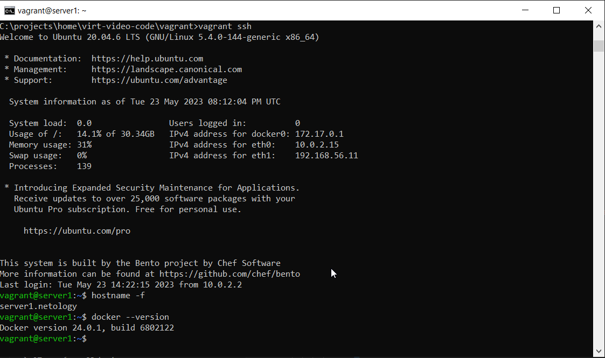

## Задача 1

- Опишите основные преимущества применения на практике IaaC-паттернов.
```
1. Более быстрая поставка продукта в релиз
2. Стабильность работы, т.к. конфигурация воспроизводится из кода результат должен быть одинаковый при каждом запуске.Возможность быстрого восстановления в случае сбоя.
3. Ускорение разработки, т.к. возможно быстро воспроизвести инфраструктуру на новом стенде, а так же быстро изменить конфигурацию и применить ко всем сборкам
```
- Какой из принципов IaaC является основополагающим?  
```
Идемпотентность - свойство объекта или операции при повторном применении операции к объекту давать тот же результат,
что и при первом.
```

## Задача 2

- Чем Ansible выгодно отличается от других систем управление конфигурациями?
```
1. Написан на языке python, который очень популярен и быстро настраивается на ОС Linux. 
2. Работает по ssh и не требует установки агента на конечных машинах
3. Работает по методу push
4. Большое комьюнити, что позволит бысто найти решение проблем  
```
- Какой, на ваш взгляд, метод работы систем конфигурации более надёжный — push или pull?
```
На мой взгляд push метод надежнее для разворачивания инфраструктуры, но может быть менее безопасен т.к. учетные данные для подкоючения к конечным узлам хранятся в конфигурации(git) 
```

## Задача 3

Установите на личный компьютер:

- [VirtualBox](https://www.virtualbox.org/),
- [Vagrant](https://github.com/netology-code/devops-materials),
- [Terraform](https://github.com/netology-code/devops-materials/blob/master/README.md),
- Ansible.

*Приложите вывод команд установленных версий каждой из программ, оформленный в Markdown.*
```
C:\projects\home\virt-video-code\vagrant>python3 -m pip show ansible
Name: ansible
Version: 7.5.0
Summary: Radically simple IT automation
Home-page: https://ansible.com/
Author: Ansible, Inc.
Author-email: info@ansible.com
License: GPLv3+
Location: c:\users\v_sid\appdata\local\packages\pythonsoftwarefoundation.python.3.9_qbz5n2kfra8p0\localcache\local-packages\python39\site-packages
Requires: ansible-core
Required-by:

C:\projects\home\virt-video-code\vagrant>vagrant --version
Vagrant 2.3.6

C:\projects\home\virt-video-code\vagrant>terraform --version
Terraform v1.4.6
on windows_amd64
```

## Задача 4 

Воспроизведите практическую часть лекции самостоятельно.

- Создайте виртуальную машину.
- Зайдите внутрь ВМ, убедитесь, что Docker установлен 



<details>
<summary>Полезные команды</summary>

Install WSL:  
`Enable-WindowsOptionalFeature -Online -FeatureName Microsoft-Windows-Subsystem-Linux`  
Add the local bin directory to PATH:  
`echo 'export PATH="${PATH}:/home/user/.local/bin"' >> ~/.bashrc`  
Install Ansible in WSL:  
`pip install ansible --user`
Install Vagrant in WSL:  
`wget https://releases.hashicorp.com/vagrant/2.1.5/vagrant_2.1.5_x86_64.deb`  
`dpkg -i vagrant_2.1.5_x86_64.deb`  
Configure Vagrant in WSL to Use VirtualBox on Windows:  
`echo 'export VAGRANT_WSL_ENABLE_WINDOWS_ACCESS="1"' >> ~/.bashrc`  
`echo 'export PATH="${PATH}:/mnt/c/Program Files/Oracle/VirtualBox"' >> ~/.bashrc`  
`source ~/.bashrc`  
Demo GitHub Repository:
`git clone https://github.com/JeffReeves/WSL-Ansible-Vagrant-VirtualBox.git`  
Vagrant:  
`vagrant box add bento/ubuntu-20.04 /mnt/c/vagrant/virtualbox/bento-ubuntu-20.04 --provider=virtualbox --force`  
`vagrant up`  
`vagrant halt`  
`vagrant destroy`  
`vagrant plugin install virtualbox_WSL2 --plugin-clean-sources --plugin-source https://rubygems.org/`  
</details>


