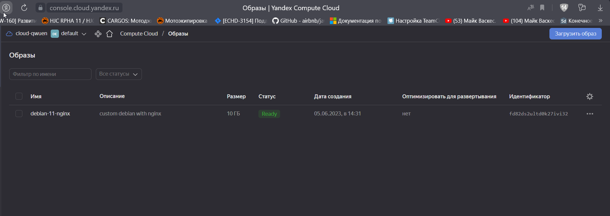
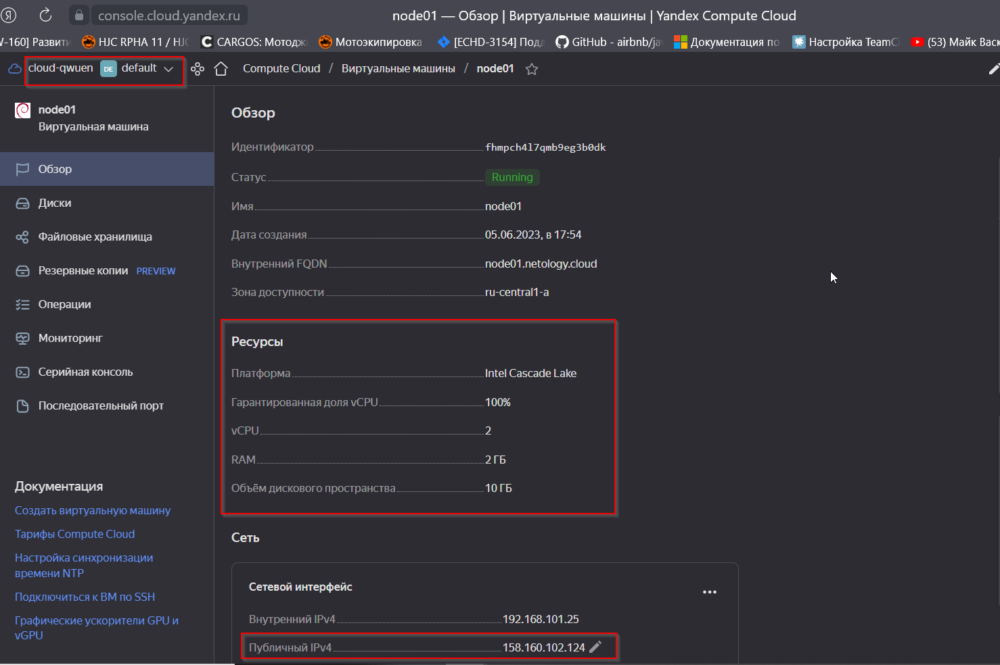
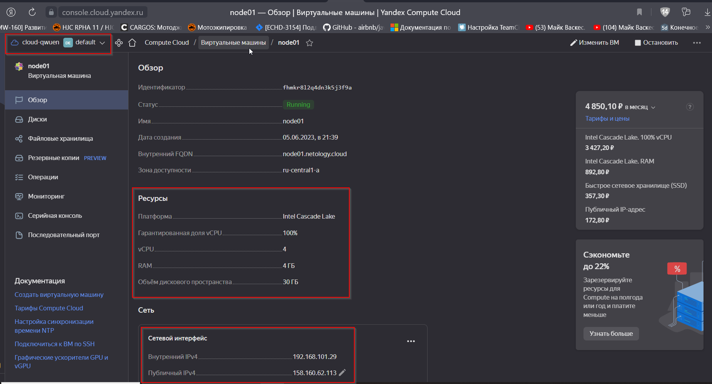
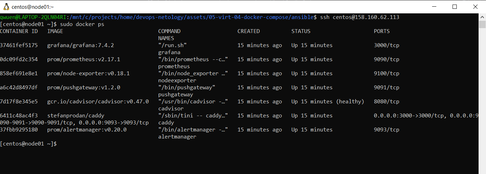
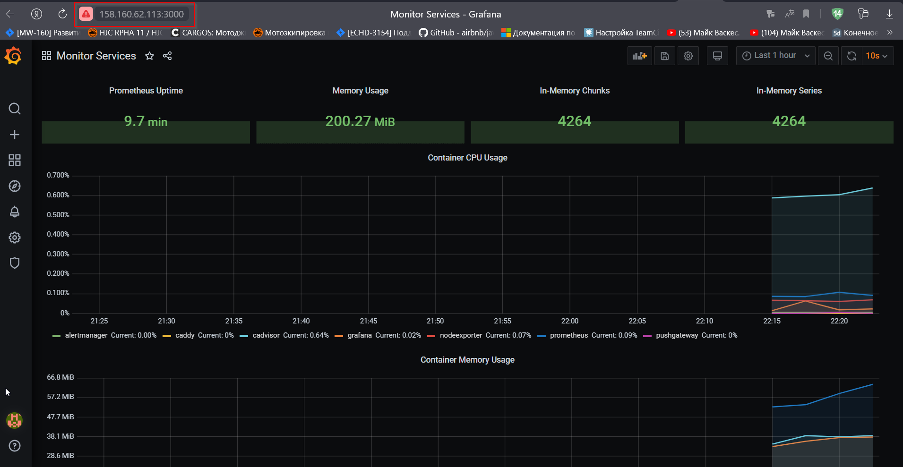

## Задача 1

Создайте собственный образ любой операционной системы (например ubuntu-20.04) с помощью Packer ([инструкция](https://cloud.yandex.ru/docs/tutorials/infrastructure-management/packer-quickstart)).



<details>

<summary>Листинг команд</summary>

- [Yandex Cloud (CLI)](https://cloud.yandex.ru/docs/cli/quickstart) 
```
curl -sSL https://storage.yandexcloud.net/yandexcloud-yc/install.sh | bash  
source ~/.bashrc
yc init
yc compute image list
yc vpc network create --name net --labels my-label=test --description "Test network"
yc vpc subnet create --name subnet-a --zone ru-central1-a --range 10.1.2.0/24 --network-name net --description "Test subnet"

```
- [Packer](https://developer.hashicorp.com/packer/tutorials/docker-get-started/get-started-install-cli#precompiled-binaries) [mirror](https://hashicorp-releases.yandexcloud.net/packer/)

```
PS C:\projects\home\devops-netology\assets\05-virt-04-docker-compose\packer> packer validate debian.json
The configuration is valid.
PS C:\projects\home\devops-netology\assets\05-virt-04-docker-compose\packer> packer build debian.json
--> yandex: A disk image was created: debian-11-nginx (id: fd82ds2ultd0k27ivi32) with family name debian-web-server
PS C:\projects\home\devops-netology\assets\05-virt-04-docker-compose\packer> yc compute image list
+----------------------+-----------------+-------------------+----------------------+--------+
|          ID          |      NAME       |      FAMILY       |     PRODUCT IDS      | STATUS |
+----------------------+-----------------+-------------------+----------------------+--------+
| fd82ds2ultd0k27ivi32 | debian-11-nginx | debian-web-server | f2eu5sakphet32oa2ss7 | READY  |
+----------------------+-----------------+-------------------+----------------------+--------+
```

</details>

----
## Задача 2

**2.1.** Создайте вашу первую виртуальную машину в YandexCloud с помощью web-интерфейса YandexCloud.        


**2.2.*** **(Необязательное задание)**      
Создайте вашу первую виртуальную машину в YandexCloud с помощью Terraform (вместо использования веб-интерфейса YandexCloud).
Используйте Terraform-код в директории ([src/terraform](https://github.com/netology-group/virt-homeworks/tree/virt-11/05-virt-04-docker-compose/src/terraform)).



[Terraform](assets/05-virt-04-docker-compose/terraform/)

<details>
<summary>Листинг команд</summary>

```
qwuen@LAPTOP-2QLN04RI:/mnt/c/projects/home/devops-netology/assets/05-virt-04-docker-compose/terraform$ terraform apply

Terraform used the selected providers to generate the following execution plan. Resource actions are indicated with the
following symbols:
  + create

Terraform will perform the following actions:

  # yandex_compute_instance.node01 will be created
  + resource "yandex_compute_instance" "node01" {
      + allow_stopping_for_update = true
      + created_at                = (known after apply)
      + folder_id                 = (known after apply)
      + fqdn                      = (known after apply)
      + gpu_cluster_id            = (known after apply)
      + hostname                  = "node01.netology.cloud"
      + id                        = (known after apply)
      + metadata                  = {
          + "ssh-keys" = <<-EOT
                centos:ssh-rsa AAAAB3NzaC1yc2EAAAADAQABAAACAQDYfgKcydfp/XapciZQ1UCZcWpaaaTtVglsDSE0F/vWXMISPQ59hwDLn30+EYncYP0Usfr+HRhD+yE9REwmmeuc490oIxtFL5Fp8vrlFCZicwPw2bhSr0hLZJM5jZGuvuEOUQxXQje6V9M9ZOfPTLe1xIN/tV0mexlI0J2J2eXKOFh+TJAAJBFrExLgAuC4LOFg+O/H7UjuUu6ucnFHy16cqOly7C39nPrUKcfgNvbJ/78VfmT/6TMjEIm5GdVkF+7M33PViISv3YkJ/LjXFhCoo231n4aiZJNRVym/qaaE86zMrWGuPSdyyC6S7VrdIpnsoWxpaOqd/OCi6tPz3R4TIxKma1PhGgWLk+2Dltn5tcMh3XJvLnBbOme51gNFqh14cWj3Qnkyn48q7pnkFerqWMWQ4DTLlY2DH/2/NuaBKAunCEuOagz45T28IOUHu9taXyNpKIEFfZxEYcY1eNWyVY0W1mH/HUQtgeGOhxWiTyZTtbgXOG+rXUmA4uYXbqorMisxQ0nGp6q0uRzWxwDo9K0kTYArUqFvT0wvJ3fYodoUPnH6i+q47S1hBScVuibaWOpmlFtOp36wX1vaYrdI7XomDpJKAI/98vF8lY07tnUlLDU6XWpBtKNO4aHj2EurtlwV4fQCNKN1r74BV5ORCD8+spRpNrSQOmyMNt/86w== qwuen@LAPTOP-2QLN04RI
            EOT
        }
      + name                      = "node01"
      + network_acceleration_type = "standard"
      + platform_id               = "standard-v2"
      + service_account_id        = (known after apply)
      + status                    = (known after apply)
      + zone                      = "ru-central1-a"

      + boot_disk {
          + auto_delete = true
          + device_name = (known after apply)
          + disk_id     = (known after apply)
          + mode        = (known after apply)

          + initialize_params {
              + block_size  = (known after apply)
              + description = (known after apply)
              + image_id    = "fd8dgtuscndkp3jmdb82"
              + name        = "root-node01"
              + size        = 30
              + snapshot_id = (known after apply)
              + type        = "network-nvme"
            }
        }

      + network_interface {
          + index              = (known after apply)
          + ip_address         = (known after apply)
          + ipv4               = true
          + ipv6               = (known after apply)
          + ipv6_address       = (known after apply)
          + mac_address        = (known after apply)
          + nat                = true
          + nat_ip_address     = (known after apply)
          + nat_ip_version     = (known after apply)
          + security_group_ids = (known after apply)
          + subnet_id          = (known after apply)
        }

      + resources {
          + core_fraction = 100
          + cores         = 4
          + memory        = 4
        }
    }

  # yandex_vpc_network.default will be created
  + resource "yandex_vpc_network" "default" {
      + created_at                = (known after apply)
      + default_security_group_id = (known after apply)
      + folder_id                 = (known after apply)
      + id                        = (known after apply)
      + labels                    = (known after apply)
      + name                      = "net"
      + subnet_ids                = (known after apply)
    }

  # yandex_vpc_subnet.default will be created
  + resource "yandex_vpc_subnet" "default" {
      + created_at     = (known after apply)
      + folder_id      = (known after apply)
      + id             = (known after apply)
      + labels         = (known after apply)
      + name           = "subnet"
      + network_id     = (known after apply)
      + v4_cidr_blocks = [
          + "192.168.101.0/24",
        ]
      + v6_cidr_blocks = (known after apply)
      + zone           = "ru-central1-a"
    }

Plan: 3 to add, 0 to change, 0 to destroy.

Changes to Outputs:
  + external_ip_address_node01_yandex_cloud = (known after apply)
  + internal_ip_address_node01_yandex_cloud = (known after apply)

Do you want to perform these actions?
  Terraform will perform the actions described above.
  Only 'yes' will be accepted to approve.

  Enter a value: yes

yandex_vpc_network.default: Creating...
yandex_vpc_network.default: Creation complete after 2s [id=enpnf58rgp52ei0llokl]
yandex_vpc_subnet.default: Creating...
yandex_vpc_subnet.default: Creation complete after 0s [id=e9b22grihvbhu3v9nk18]
yandex_compute_instance.node01: Creating...
yandex_compute_instance.node01: Still creating... [10s elapsed]
yandex_compute_instance.node01: Still creating... [20s elapsed]
yandex_compute_instance.node01: Still creating... [30s elapsed]
yandex_compute_instance.node01: Creation complete after 32s [id=fhmkr8l2q4dn3k5j3f9a]

Apply complete! Resources: 3 added, 0 changed, 0 destroyed.

Outputs:

external_ip_address_node01_yandex_cloud = "158.160.62.113"
internal_ip_address_node01_yandex_cloud = "192.168.101.29"
```
</details>

-----
## Задача 3

С помощью Ansible и Docker Compose разверните на виртуальной машине из предыдущего задания систему мониторинга на основе Prometheus/Grafana.
Используйте Ansible-код в директории ([src/ansible](https://github.com/netology-group/virt-homeworks/tree/virt-11/05-virt-04-docker-compose/src/ansible)).



<details>
<summary>Листинг команд</summary>

```
qwuen@LAPTOP-2QLN04RI:/mnt/c/projects/home/devops-netology/assets/05-virt-04-docker-compose/ansible$ terraform apply
qwuen@LAPTOP-2QLN04RI:/mnt/c/projects/home/devops-netology/assets/05-virt-04-docker-compose/ansible$ ansible-playbook provision.yml --inventory-file inventory
qwuen@LAPTOP-2QLN04RI:/mnt/c/projects/home/devops-netology/assets/05-virt-04-docker-compose/ansible$ ssh centos@158.160.62.113
[centos@node01 ~]$ sudo docker ps
CONTAINER ID   IMAGE                              COMMAND                  CREATED         STATUS                   PORTS                                                                              NAMES
37461fef5175   grafana/grafana:7.4.2              "/run.sh"                2 minutes ago   Up 2 minutes             3000/tcp                                                                           grafana
0dc09fd2c354   prom/prometheus:v2.17.1            "/bin/prometheus --c…"   2 minutes ago   Up 2 minutes             9090/tcp                                                                           prometheus
858ef691e8e1   prom/node-exporter:v0.18.1         "/bin/node_exporter …"   2 minutes ago   Up 2 minutes             9100/tcp                                                                           nodeexporter
a6c42d8497df   prom/pushgateway:v1.2.0            "/bin/pushgateway"       2 minutes ago   Up 2 minutes             9091/tcp                                                                           pushgateway
7d17f8e345e5   gcr.io/cadvisor/cadvisor:v0.47.0   "/usr/bin/cadvisor -…"   2 minutes ago   Up 2 minutes (healthy)   8080/tcp                                                                           cadvisor
6411c48ac4f3   stefanprodan/caddy                 "/sbin/tini -- caddy…"   2 minutes ago   Up 2 minutes             0.0.0.0:3000->3000/tcp, 0.0.0.0:9090-9091->9090-9091/tcp, 0.0.0.0:9093->9093/tcp   caddy
37fbb9295180   prom/alertmanager:v0.20.0          "/bin/alertmanager -…"   2 minutes ago   Up 2 minutes             9093/tcp                                                                           alertmanager
```
</details>

----
## Задача 4

1. Откройте веб-браузер, зайдите на страницу http://<внешний_ip_адрес_вашей_ВМ>:3000.
2. Используйте для авторизации логин и пароль из [.env-file](https://github.com/netology-group/virt-homeworks/blob/virt-11/05-virt-04-docker-compose/src/ansible/stack/.env).
3. Изучите доступный интерфейс, найдите в интерфейсе автоматически созданные docker-compose-панели с графиками([dashboards](https://grafana.com/docs/grafana/latest/dashboards/use-dashboards/)).
4. Подождите 5-10 минут, чтобы система мониторинга успела накопить данные.



