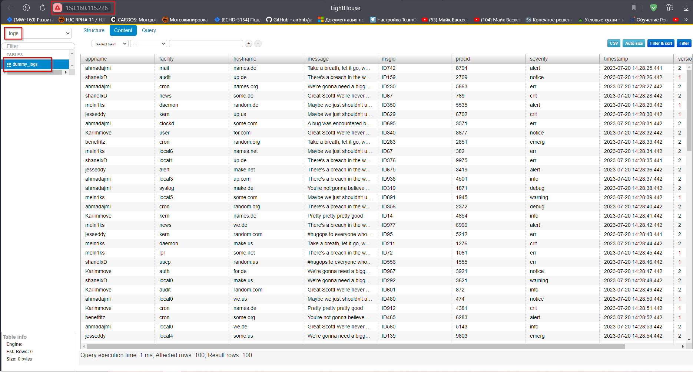

# Домашнее задание к занятию 3 «Использование Ansible»

#### Доп. материалы
- Репозиторий LightHouse находится [по ссылке](https://github.com/VKCOM/lighthouse).

<details>
<summary>Требования</summary>

1. Допишите playbook: нужно сделать ещё один play, который устанавливает и настраивает LightHouse.
2. При создании tasks рекомендую использовать модули: `get_url`, `template`, `yum`, `apt`.
3. Tasks должны: скачать статику LightHouse, установить Nginx или любой другой веб-сервер, настроить его конфиг для открытия LightHouse, запустить веб-сервер.
4. Подготовьте свой inventory-файл `prod.yml`.
5. Запустите `ansible-lint site.yml` и исправьте ошибки, если они есть.
6. Попробуйте запустить playbook на этом окружении с флагом `--check`.
7. Запустите playbook на `prod.yml` окружении с флагом `--diff`. Убедитесь, что изменения на системе произведены.
8. Повторно запустите playbook с флагом `--diff` и убедитесь, что playbook идемпотентен.
9. Подготовьте README.md-файл по своему playbook. В нём должно быть описано: что делает playbook, какие у него есть параметры и теги.
10. Готовый playbook выложите в свой репозиторий, поставьте тег `08-ansible-03-yandex` на фиксирующий коммит, в ответ предоставьте ссылку на него.
</details>

<details>
<summary>Разворачивание БД ClickHouse </summary>

```sh
qwuen@MSI:/mnt/d/projects/devops-netology/assets/08-ansible-03-yandex/playbook$ ansible-playbook -i inventory/prod.yml site.yml --tags clickhouse

PLAY [Ping] ************************************************************************************************************

PLAY [Install Clickhouse] **********************************************************************************************

TASK [Gathering Facts] *************************************************************************************************
ok: [clickhouse-01]

TASK [Get clickhouse distrib] ******************************************************************************************
changed: [clickhouse-01] => (item=clickhouse-client)
changed: [clickhouse-01] => (item=clickhouse-server)
failed: [clickhouse-01] (item=clickhouse-common-static) => {"ansible_loop_var": "item", "changed": false, "dest": "./clickhouse-common-static-22.3.3.44.rpm", "elapsed": 0, "item": "clickhouse-common-static", "msg": "Request failed", "response": "HTTP Error 404: Not Found", "status_code": 404, "url": "https://packages.clickhouse.com/rpm/stable/clickhouse-common-static-22.3.3.44.noarch.rpm"}

TASK [Get clickhouse distrib] ******************************************************************************************
changed: [clickhouse-01]

TASK [Install clickhouse packages] *************************************************************************************
changed: [clickhouse-01]

TASK [Enable remote connections to clickhouse server] ******************************************************************
changed: [clickhouse-01]

TASK [Flush handlers] **************************************************************************************************

RUNNING HANDLER [Start clickhouse service] *****************************************************************************
changed: [clickhouse-01]

TASK [Create database] *************************************************************************************************
changed: [clickhouse-01]

TASK [Create table] ****************************************************************************************************
changed: [clickhouse-01]

PLAY [Install Vector manual] *******************************************************************************************

PLAY [Install lighthouse] **********************************************************************************************

PLAY RECAP *************************************************************************************************************
clickhouse-01              : ok=7    changed=6    unreachable=0    failed=0    skipped=0    rescued=1    ignored=0

```
</details>

<details>
<summary>Разворачивание Vector </summary>

```sh
qwuen@MSI:/mnt/d/projects/devops-netology/assets/08-ansible-03-yandex/playbook$ ansible-playbook -i inventory/prod.yml site.yml --tags vector

PLAY [Ping] ************************************************************************************************************

PLAY [Install Clickhouse] **********************************************************************************************

PLAY [Install Vector manual] *******************************************************************************************

TASK [Gathering Facts] *************************************************************************************************
The authenticity of host '158.160.43.203 (158.160.43.203)' can't be established.
ED25519 key fingerprint is SHA256:J+Uo5cRtqMs4YdmdjfdXRRKS/sFxGzJfgpJkgpFE9ec.
This key is not known by any other names.
Are you sure you want to continue connecting (yes/no/[fingerprint])? yes
ok: [vector-01]

TASK [Get vector distrib] **********************************************************************************************
changed: [vector-01]

TASK [Install vector package] ******************************************************************************************
changed: [vector-01]

TASK [Redefine vector config name] *************************************************************************************
changed: [vector-01]

TASK [Create vector config] ********************************************************************************************
changed: [vector-01]

TASK [Flush handlers] **************************************************************************************************

RUNNING HANDLER [Start Vector service] *********************************************************************************
changed: [vector-01]

PLAY [Install lighthouse] **********************************************************************************************

PLAY RECAP *************************************************************************************************************
vector-01                  : ok=6    changed=5    unreachable=0    failed=0    skipped=0    rescued=0    ignored=0

```
</details>

<details>
<summary>Разворачивание Lighthouse</summary>

```sh
qwuen@MSI:/mnt/d/projects/devops-netology/assets/08-ansible-03-yandex/playbook$ ansible-playbook -i inventory/prod.yml site.yml --tags lighthouse

PLAY [Ping] ************************************************************************************************************

PLAY [Install Clickhouse] **********************************************************************************************

PLAY [Install Vector manual] *******************************************************************************************

PLAY [Install lighthouse] **********************************************************************************************

TASK [Gathering Facts] *************************************************************************************************
The authenticity of host '158.160.115.226 (158.160.115.226)' can't be established.
ED25519 key fingerprint is SHA256:gtEUdUge93pyPoQIWHOxnT7hzm7FSgNqdQg3jIP0JEk.
This key is not known by any other names.
Are you sure you want to continue connecting (yes/no/[fingerprint])? yes
ok: [lighthouse-01]

TASK [add repo nginx] **************************************************************************************************
changed: [lighthouse-01]

TASK [install nginx and git] *******************************************************************************************
changed: [lighthouse-01]

TASK [Get lighthouse from git] *****************************************************************************************
changed: [lighthouse-01]

TASK [Configure nginx from template] ***********************************************************************************
changed: [lighthouse-01]

TASK [Flush handlers] **************************************************************************************************

RUNNING HANDLER [restarted nginx service] ******************************************************************************
changed: [lighthouse-01]

PLAY RECAP *************************************************************************************************************
lighthouse-01              : ok=6    changed=5    unreachable=0    failed=0    skipped=0    rescued=0    ignored=0

```
</details>

---

### Инфраструктура:

Инфраструктура разворачивается с помощью `Terraform`  
Команда: `\\08-ansible-03-yandex\terraform>terraform apply`   

Проект terraform: [ссылка](/assets/08-ansible-03-yandex/terraform/)  
Генерация inventory:  
[ansible.tf](/assets/08-ansible-03-yandex/terraform/ansible.tf)  
[prod.yml](/assets/08-ansible-03-yandex/playbook/inventory/prod.yml)  
После выполнения команды будет поднято три ВМ.  
Имена и ip-адреса ВМ будут выведены в output:  
```sh
Apply complete! Resources: 6 added, 0 changed, 0 destroyed.

Outputs:

vm_external_ip_address = [
  {
    "host" = "clickhouse"
    "ip" = "158.160.116.36"
  },
  {
    "host" = "vector"
    "ip" = "158.160.43.203"
  },
  {
    "host" = "lighthouse"
    "ip" = "158.160.115.226"
  },
]
```

### Playbook
Playbook производит настройку трех ВМ:  
- `vector-01` - для сбора логов на сервере и передачу на сервер Сlickhouse
- `clickhouse-01` - для разворачивания БД ClickHouse и хранения логов
- `lighthouse-01` - для отображения логов из ClickHouse

[site.yml](/assets/08-ansible-03-yandex/playbook/site.yml)

## Variables
Значения переменных устанавливаются в файлах `vars.yml` в соответствующих директориях в `group_vars`  
Требуется задать следующие параметры:
- `clickhouse_version`, `vector_version` - версии устанавливаемых приложений;
- `clickhouse_database_name` - имя базы данных в `clickhouse`;
- `clickhouse_create_table_name` - имя таблицы в `clickhouse`;
- `vector_config` - содержимое конфигурационного файла для приложения `vector`;
- `lighthouse_home_dir` - домашняя директория `lighthouse` 
- `nginx_config_dir` - директория расположения конфига `nginx`
---

## Tags

`ping` - Проверяет доступность серверов  
`clickhouse` - производит полную конфигурацию сервера `clickhouse-01`;  
`vector` - производит полную конфигурацию сервера `vector-01`;  
`vector_config` - производит изменение в конфиге приложения `vector`;  
`lighthouse` - производит полную конфигурацию сервера `lighthouse-01`;

---

### Отображение логов в LightHouse
