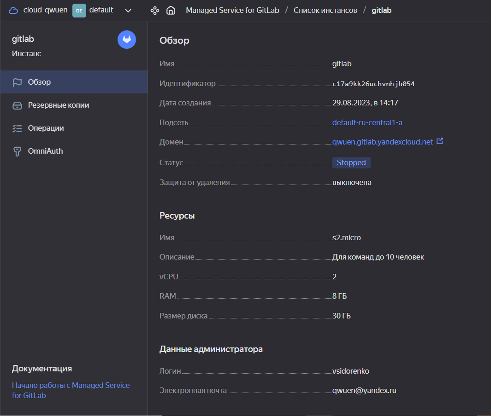
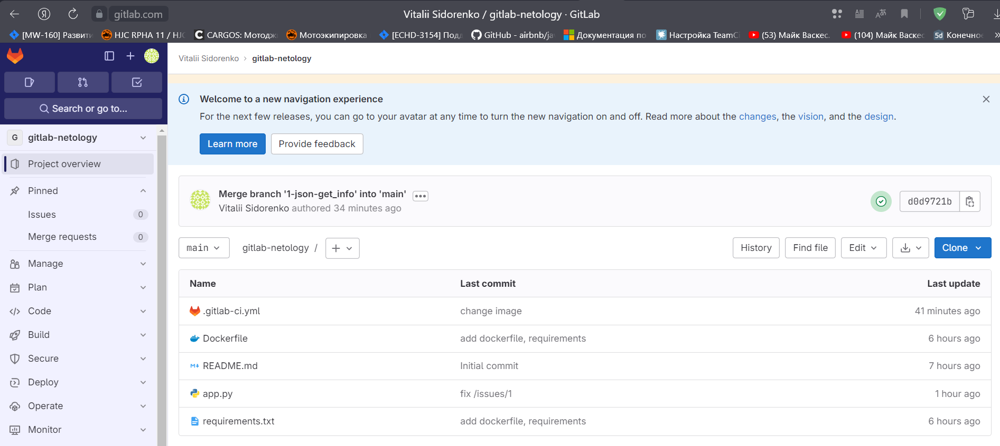
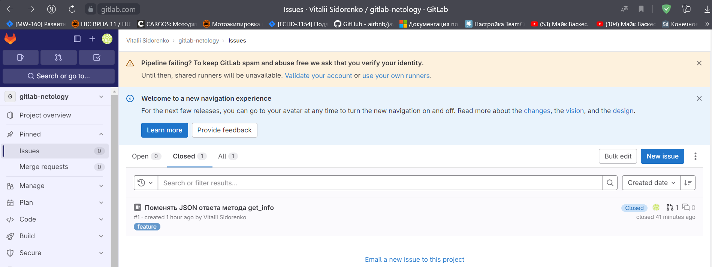

# Домашнее задание к занятию 12 «GitLab»

## Основная часть

### DevOps
<details>
<summary>Требования</summary>

В репозитории содержится код проекта на Python. Проект — RESTful API сервис. Ваша задача — автоматизировать сборку образа с выполнением python-скрипта:

1. Образ собирается на основе [centos:7](https://hub.docker.com/_/centos?tab=tags&page=1&ordering=last_updated).
2. Python версии не ниже 3.7.
3. Установлены зависимости: `flask` `flask-jsonpify` `flask-restful`.
4. Создана директория `/python_api`.
5. Скрипт из репозитория размещён в /python_api.
6. Точка вызова: запуск скрипта.
7. При комите в любую ветку должен собираться docker image с форматом имени hello:gitlab-$CI_COMMIT_SHORT_SHA . Образ должен быть выложен в Gitlab registry или yandex registry.   
8.* (задание необязательное к выполению) При комите в ветку master после сборки должен подняться pod в kubernetes. Примерный pipeline для push в kubernetes по [ссылке](https://github.com/awertoss/devops-netology/blob/main/09-ci-06-gitlab/gitlab-ci.yml).
Если вы еще не знакомы с k8s - автоматизируйте сборку и деплой приложения в docker на виртуальной машине.
</details>

[Проект](https://gitlab.com/qwuens/gitlab-netology)  
[gitlab-ci.yml](assets/09-ci-06-gitlab/gitlab-ci.yml)  
[Dockerfile](assets/09-ci-06-gitlab/Dockerfile)  

Проект в yandex.cloud:  
  

Содержимое проекта:

### Product Owner
<details>
<summary>Требования</summary>

Вашему проекту нужна бизнесовая доработка: нужно поменять JSON ответа на вызов метода GET `/rest/api/get_info`, необходимо создать Issue в котором указать:

1. Какой метод необходимо исправить.
2. Текст с `{ "message": "Already started" }` на `{ "message": "Running"}`.
3. Issue поставить label: feature.
</details>

[Ссылка на задачу](https://gitlab.com/qwuens/gitlab-netology/-/issues/1)  
  

### Developer
<details>
<summary>Требования</summary>
Пришёл новый Issue на доработку, вам нужно:

1. Создать отдельную ветку, связанную с этим Issue.
2. Внести изменения по тексту из задания.
3. Подготовить Merge Request, влить необходимые изменения в `master`, проверить, что сборка прошла успешно.
</details>

[Merge request](https://gitlab.com/qwuens/gitlab-netology/-/merge_requests?scope=all&state=merged)  
[app.py](assets/09-ci-06-gitlab/app.py)  
  

<details>
<summary>Логи сборки</summary>
```sh
Running with gitlab-runner 16.3.0 (8ec04662)
  on run VmSTcSH4_, system ID: s_c5d225be5a1a
Preparing the "docker" executor
Using Docker executor with image docker:18.09 ...
Starting service docker:18.09-dind ...
Pulling docker image docker:18.09-dind ...
Using docker image sha256:27105793dc2bbf270ec87d6a9ba041bba52cfef66384251980a4d55d03ed736c for docker:18.09-dind with digest docker@sha256:86df3c3573065f2c6f24cd925fd5bc3a0aff899bdf664ff4d2e3ebab26d96bed ...
Waiting for services to be up and running (timeout 30 seconds)...
Pulling docker image docker:18.09 ...
Using docker image sha256:074f1687a41ccf251dae357352554e41bd8168aecd480acab710389d6f78837d for docker:18.09 with digest docker@sha256:58469a43b529313091f1df424037895a9961b27149aafec812ce8fd8d7ac0c9d ...
Preparing environment
00:01
Running on runner-vmstcsh4-project-48887481-concurrent-0 via LAPTOP-2QLN04RI...
Getting source from Git repository
00:02
Fetching changes with git depth set to 20...
Reinitialized existing Git repository in /builds/qwuens/gitlab-netology/.git/
Checking out 0ac2d6f3 as detached HEAD (ref is 1-json-get_info)...
Skipping Git submodules setup
Executing "step_script" stage of the job script
03:42
Using docker image sha256:074f1687a41ccf251dae357352554e41bd8168aecd480acab710389d6f78837d for docker:18.09 with digest docker@sha256:58469a43b529313091f1df424037895a9961b27149aafec812ce8fd8d7ac0c9d ...
$ docker login -u $CI_REGISTRY_USER -p $CI_REGISTRY_PASSWORD $CI_REGISTRY
WARNING! Using --password via the CLI is insecure. Use --password-stdin.
WARNING! Your password will be stored unencrypted in /root/.docker/config.json.
Configure a credential helper to remove this warning. See
https://docs.docker.com/engine/reference/commandline/login/#credentials-store
Login Succeeded
$ docker build -t $CI_REGISTRY/$CI_PROJECT_PATH/$IMAGE_NAME:gitlab-$CI_COMMIT_SHORT_SHA -t $CI_REGISTRY/$CI_PROJECT_PATH/$IMAGE_NAME:latest .
Step 1/7 : FROM centos:7
7: Pulling from library/centos
2d473b07cdd5: Pulling fs layer
2d473b07cdd5: Verifying Checksum
2d473b07cdd5: Download complete
2d473b07cdd5: Pull complete
Digest: sha256:be65f488b7764ad3638f236b7b515b3678369a5124c47b8d32916d6487418ea4
Status: Downloaded newer image for centos:7
 ---> eeb6ee3f44bd
Step 2/7 : RUN yum install python3 python3-pip -y
 ---> Running in eb20ffb63046
Loaded plugins: fastestmirror, ovl
Determining fastest mirrors
 * base: mirror.axelname.ru
 * extras: centos-mirror.rbc.ru
 * updates: centos-mirror.rbc.ru
Resolving Dependencies
--> Running transaction check
---> Package python3.x86_64 0:3.6.8-19.el7_9 will be installed
--> Processing Dependency: python3-libs(x86-64) = 3.6.8-19.el7_9 for package: python3-3.6.8-19.el7_9.x86_64
--> Processing Dependency: python3-setuptools for package: python3-3.6.8-19.el7_9.x86_64
--> Processing Dependency: libpython3.6m.so.1.0()(64bit) for package: python3-3.6.8-19.el7_9.x86_64
---> Package python3-pip.noarch 0:9.0.3-8.el7 will be installed
--> Running transaction check
---> Package python3-libs.x86_64 0:3.6.8-19.el7_9 will be installed
--> Processing Dependency: libtirpc.so.1()(64bit) for package: python3-libs-3.6.8-19.el7_9.x86_64
---> Package python3-setuptools.noarch 0:39.2.0-10.el7 will be installed
--> Running transaction check
---> Package libtirpc.x86_64 0:0.2.4-0.16.el7 will be installed
--> Finished Dependency Resolution
Dependencies Resolved
================================================================================
 Package                  Arch         Version              Repository     Size
================================================================================
Installing:
 python3                  x86_64       3.6.8-19.el7_9       updates        70 k
 python3-pip              noarch       9.0.3-8.el7          base          1.6 M
Installing for dependencies:
 libtirpc                 x86_64       0.2.4-0.16.el7       base           89 k
 python3-libs             x86_64       3.6.8-19.el7_9       updates       6.9 M
 python3-setuptools       noarch       39.2.0-10.el7        base          629 k
Transaction Summary
================================================================================
Install  2 Packages (+3 Dependent packages)
Total download size: 9.3 M
Installed size: 48 M
Downloading packages:
warning: /var/cache/yum/x86_64/7/updates/packages/python3-3.6.8-19.el7_9.x86_64.rpm: Header V4 RSA/SHA256 Signature, key ID f4a80eb5: NOKEY
Public key for python3-3.6.8-19.el7_9.x86_64.rpm is not installed
Public key for libtirpc-0.2.4-0.16.el7.x86_64.rpm is not installed
--------------------------------------------------------------------------------
Total                                              1.1 MB/s | 9.3 MB  00:08     
Retrieving key from file:///etc/pki/rpm-gpg/RPM-GPG-KEY-CentOS-7
Importing GPG key 0xF4A80EB5:
 Userid     : "CentOS-7 Key (CentOS 7 Official Signing Key) <security@centos.org>"
 Fingerprint: 6341 ab27 53d7 8a78 a7c2 7bb1 24c6 a8a7 f4a8 0eb5
 Package    : centos-release-7-9.2009.0.el7.centos.x86_64 (@CentOS)
 From       : /etc/pki/rpm-gpg/RPM-GPG-KEY-CentOS-7
Running transaction check
Running transaction test
Transaction test succeeded
Running transaction
  Installing : libtirpc-0.2.4-0.16.el7.x86_64                               1/5 
  Installing : python3-setuptools-39.2.0-10.el7.noarch                      2/5 
  Installing : python3-pip-9.0.3-8.el7.noarch                               3/5 
  Installing : python3-3.6.8-19.el7_9.x86_64                                4/5 
  Installing : python3-libs-3.6.8-19.el7_9.x86_64                           5/5 
  Verifying  : libtirpc-0.2.4-0.16.el7.x86_64                               1/5 
  Verifying  : python3-libs-3.6.8-19.el7_9.x86_64                           2/5 
  Verifying  : python3-3.6.8-19.el7_9.x86_64                                3/5 
  Verifying  : python3-setuptools-39.2.0-10.el7.noarch                      4/5 
  Verifying  : python3-pip-9.0.3-8.el7.noarch                               5/5 
Installed:
  python3.x86_64 0:3.6.8-19.el7_9        python3-pip.noarch 0:9.0.3-8.el7       
Dependency Installed:
  libtirpc.x86_64 0:0.2.4-0.16.el7                                              
  python3-libs.x86_64 0:3.6.8-19.el7_9                                          
  python3-setuptools.noarch 0:39.2.0-10.el7                                     
Complete!
Removing intermediate container eb20ffb63046
 ---> afff0203d5f9
Step 3/7 : COPY requirements.txt requirements.txt
 ---> 36ef5f383b74
Step 4/7 : RUN pip3 install -r requirements.txt
 ---> Running in f2666a89ba21
WARNING: Running pip install with root privileges is generally not a good idea. Try `pip3 install --user` instead.
Collecting flask (from -r requirements.txt (line 1))
  Downloading https://files.pythonhosted.org/packages/cd/77/59df23681f4fd19b7cbbb5e92484d46ad587554f5d490f33ef907e456132/Flask-2.0.3-py3-none-any.whl (95kB)
Collecting flask-jsonpify (from -r requirements.txt (line 2))
  Downloading https://files.pythonhosted.org/packages/60/0f/c389dea3988bffbe32c1a667989914b1cc0bce31b338c8da844d5e42b503/Flask-Jsonpify-1.5.0.tar.gz
Collecting flask-restful (from -r requirements.txt (line 3))
  Downloading https://files.pythonhosted.org/packages/d7/7b/f0b45f0df7d2978e5ae51804bb5939b7897b2ace24306009da0cc34d8d1f/Flask_RESTful-0.3.10-py2.py3-none-any.whl
Collecting click>=7.1.2 (from flask->-r requirements.txt (line 1))
  Downloading https://files.pythonhosted.org/packages/4a/a8/0b2ced25639fb20cc1c9784de90a8c25f9504a7f18cd8b5397bd61696d7d/click-8.0.4-py3-none-any.whl (97kB)
Collecting Jinja2>=3.0 (from flask->-r requirements.txt (line 1))
  Downloading https://files.pythonhosted.org/packages/20/9a/e5d9ec41927401e41aea8af6d16e78b5e612bca4699d417f646a9610a076/Jinja2-3.0.3-py3-none-any.whl (133kB)
Collecting itsdangerous>=2.0 (from flask->-r requirements.txt (line 1))
  Downloading https://files.pythonhosted.org/packages/9c/96/26f935afba9cd6140216da5add223a0c465b99d0f112b68a4ca426441019/itsdangerous-2.0.1-py3-none-any.whl
Collecting Werkzeug>=2.0 (from flask->-r requirements.txt (line 1))
  Downloading https://files.pythonhosted.org/packages/f4/f3/22afbdb20cc4654b10c98043414a14057cd27fdba9d4ae61cea596000ba2/Werkzeug-2.0.3-py3-none-any.whl (289kB)
Collecting pytz (from flask-restful->-r requirements.txt (line 3))
  Downloading https://files.pythonhosted.org/packages/7f/99/ad6bd37e748257dd70d6f85d916cafe79c0b0f5e2e95b11f7fbc82bf3110/pytz-2023.3-py2.py3-none-any.whl (502kB)
Collecting six>=1.3.0 (from flask-restful->-r requirements.txt (line 3))
  Downloading https://files.pythonhosted.org/packages/d9/5a/e7c31adbe875f2abbb91bd84cf2dc52d792b5a01506781dbcf25c91daf11/six-1.16.0-py2.py3-none-any.whl
Collecting aniso8601>=0.82 (from flask-restful->-r requirements.txt (line 3))
  Downloading https://files.pythonhosted.org/packages/e3/04/e97c12dc034791d7b504860acfcdd2963fa21ae61eaca1c9d31245f812c3/aniso8601-9.0.1-py2.py3-none-any.whl (52kB)
Collecting importlib-metadata; python_version < "3.8" (from click>=7.1.2->flask->-r requirements.txt (line 1))
  Downloading https://files.pythonhosted.org/packages/a0/a1/b153a0a4caf7a7e3f15c2cd56c7702e2cf3d89b1b359d1f1c5e59d68f4ce/importlib_metadata-4.8.3-py3-none-any.whl
Collecting MarkupSafe>=2.0 (from Jinja2>=3.0->flask->-r requirements.txt (line 1))
  Downloading https://files.pythonhosted.org/packages/fc/d6/57f9a97e56447a1e340f8574836d3b636e2c14de304943836bd645fa9c7e/MarkupSafe-2.0.1-cp36-cp36m-manylinux1_x86_64.whl
Collecting dataclasses; python_version < "3.7" (from Werkzeug>=2.0->flask->-r requirements.txt (line 1))
  Downloading https://files.pythonhosted.org/packages/fe/ca/75fac5856ab5cfa51bbbcefa250182e50441074fdc3f803f6e76451fab43/dataclasses-0.8-py3-none-any.whl
Collecting zipp>=0.5 (from importlib-metadata; python_version < "3.8"->click>=7.1.2->flask->-r requirements.txt (line 1))
  Downloading https://files.pythonhosted.org/packages/bd/df/d4a4974a3e3957fd1c1fa3082366d7fff6e428ddb55f074bf64876f8e8ad/zipp-3.6.0-py3-none-any.whl
Collecting typing-extensions>=3.6.4; python_version < "3.8" (from importlib-metadata; python_version < "3.8"->click>=7.1.2->flask->-r requirements.txt (line 1))
  Downloading https://files.pythonhosted.org/packages/45/6b/44f7f8f1e110027cf88956b59f2fad776cca7e1704396d043f89effd3a0e/typing_extensions-4.1.1-py3-none-any.whl
Installing collected packages: zipp, typing-extensions, importlib-metadata, click, MarkupSafe, Jinja2, itsdangerous, dataclasses, Werkzeug, flask, flask-jsonpify, pytz, six, aniso8601, flask-restful
  Running setup.py install for flask-jsonpify: started
    Running setup.py install for flask-jsonpify: finished with status 'done'
Successfully installed Jinja2-3.0.3 MarkupSafe-2.0.1 Werkzeug-2.0.3 aniso8601-9.0.1 click-8.0.4 dataclasses-0.8 flask-2.0.3 flask-jsonpify-1.5.0 flask-restful-0.3.10 importlib-metadata-4.8.3 itsdangerous-2.0.1 pytz-2023.3 six-1.16.0 typing-extensions-4.1.1 zipp-3.6.0
Removing intermediate container f2666a89ba21
 ---> 1237cd94f837
Step 5/7 : RUN mkdir /python_api
 ---> Running in 7dd450bc09ca
Removing intermediate container 7dd450bc09ca
 ---> 6d7e330697b6
Step 6/7 : COPY app.py /python_api/app.py
 ---> cdb053c6c3e9
Step 7/7 : CMD ["python3", "/python_api/app.py"]
 ---> Running in d021afa4892f
Removing intermediate container d021afa4892f
 ---> 6e91dfd44637
Successfully built 6e91dfd44637
Successfully tagged registry.gitlab.com/qwuens/gitlab-netology/hello:gitlab-0ac2d6f3
Successfully tagged registry.gitlab.com/qwuens/gitlab-netology/hello:latest
$ docker push $CI_REGISTRY/$CI_PROJECT_PATH/$IMAGE_NAME:gitlab-$CI_COMMIT_SHORT_SHA
The push refers to repository [registry.gitlab.com/qwuens/gitlab-netology/hello]
09f50e86d211: Preparing
3eae5defdd74: Preparing
e48dffe61451: Preparing
ed47b1e1744b: Preparing
c9e217fa1268: Preparing
174f56854903: Preparing
174f56854903: Waiting
ed47b1e1744b: Pushed
3eae5defdd74: Pushed
09f50e86d211: Pushed
174f56854903: Layer already exists
e48dffe61451: Pushed
c9e217fa1268: Pushed
gitlab-0ac2d6f3: digest: sha256:4446264c12c10e4cdc06fdc296d19f3905800faa73ee4ece96abdbff29995701 size: 1573
$ docker push $CI_REGISTRY/$CI_PROJECT_PATH/$IMAGE_NAME:latest
The push refers to repository [registry.gitlab.com/qwuens/gitlab-netology/hello]
09f50e86d211: Preparing
3eae5defdd74: Preparing
e48dffe61451: Preparing
ed47b1e1744b: Preparing
c9e217fa1268: Preparing
174f56854903: Preparing
174f56854903: Waiting
ed47b1e1744b: Layer already exists
3eae5defdd74: Layer already exists
e48dffe61451: Layer already exists
09f50e86d211: Layer already exists
c9e217fa1268: Layer already exists
174f56854903: Layer already exists
latest: digest: sha256:4446264c12c10e4cdc06fdc296d19f3905800faa73ee4ece96abdbff29995701 size: 1573
Cleaning up project directory and file based variables
00:00
Job succeeded
```
</details>

### Tester
<details>
<summary>Требования</summary>
Разработчики выполнили новый Issue, необходимо проверить валидность изменений:

1. Поднять докер-контейнер с образом `python-api:latest` и проверить возврат метода на корректность.
2. Закрыть Issue с комментарием об успешности прохождения, указав желаемый результат и фактически достигнутый.
</details>

```sh
qwuen@LAPTOP-2QLN04RI:/mnt/c/Users/v_sid$ docker run -it --rm -p 5290:5290 --name python-api -d registry.gitlab.com/qwuens/gitlab-netology/hello:latest
Unable to find image 'registry.gitlab.com/qwuens/gitlab-netology/hello:latest' locally
latest: Pulling from qwuens/gitlab-netology/hello
2d473b07cdd5: Already exists
1d623804fd0f: Pull complete
bc1cb9de5b56: Pull complete
4061786ec470: Pull complete
4468224343a1: Pull complete
a79f8e5b220b: Pull complete
Digest: sha256:14e7e69cae4f0964eb2b9a326c3c1d7a625f39af01fa3113fa31e865f0257932
Status: Downloaded newer image for registry.gitlab.com/qwuens/gitlab-netology/hello:latest
33e22a308ef6dbc4fa3a3e56ac32f8181241b8d6c41f9cafe54f51d67ca5f905
qwuen@LAPTOP-2QLN04RI:/mnt/c/Users/v_sid$ curl localhost:5290/get_info
{"version": 3, "method": "GET", "message": "Running"}
```
