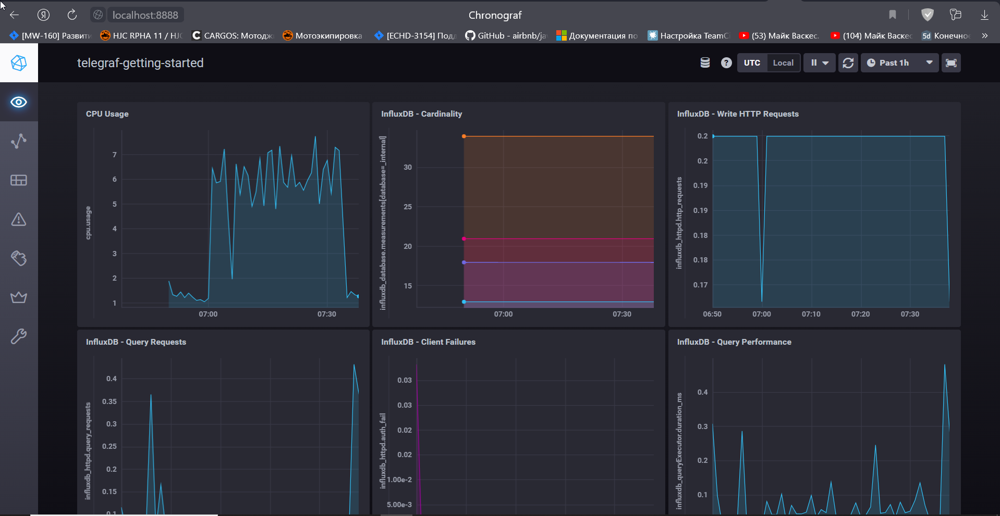
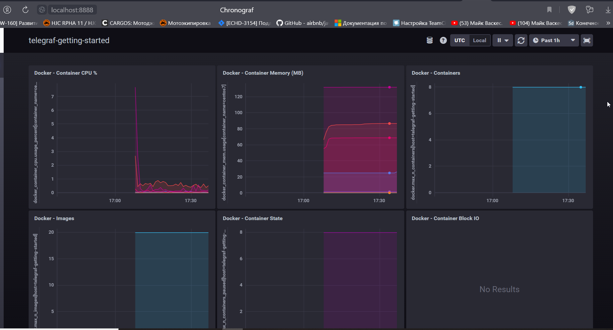
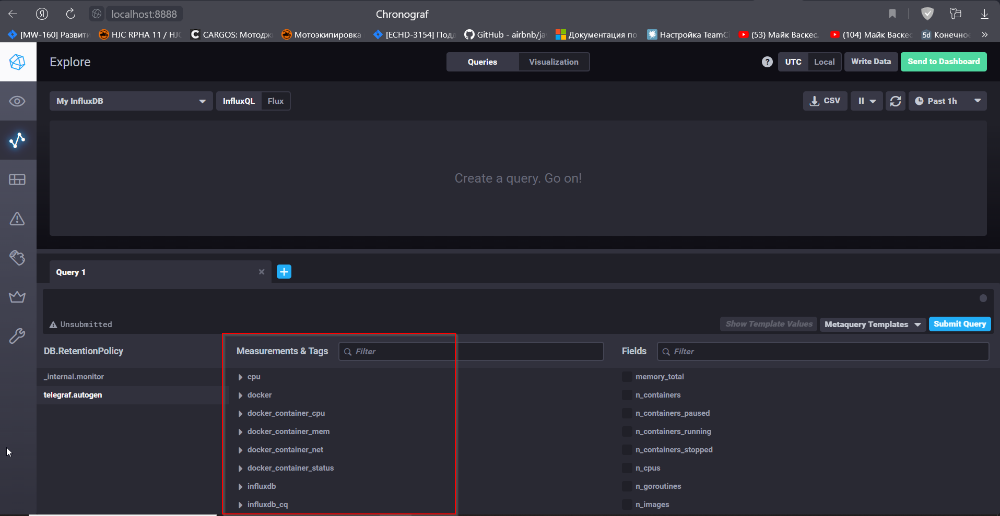

# Домашнее задание к занятию "13.Системы мониторинга"

## Обязательные задания

1. Вас пригласили настроить мониторинг на проект. На онбординге вам рассказали, что проект представляет из себя 
платформу для вычислений с выдачей текстовых отчетов, которые сохраняются на диск. Взаимодействие с платформой 
осуществляется по протоколу http. Также вам отметили, что вычисления загружают ЦПУ. Какой минимальный набор метрик вы
выведите в мониторинг и почему?

<details>
<summary>Ответ</summary>

Рекомендуется мониторить следующие метрики:  
- Загруженность процессора (CPU LA)
- Нагрузка на диски ( время отклика `latency`, число операций в секунду `IOPS`, процессорное ожидание ввода/вывода `iowait`, индексные дескрипторы `inodes` )
- Использование RAM (`RAM/swap`)
- Нагрузка на API (мониторинг количества ошибочных ответов, доступность сервиса, время ответа)
- Нагрузка на сеть  

</details>

---

2. Менеджер продукта посмотрев на ваши метрики сказал, что ему непонятно что такое RAM/inodes/CPUla. Также он сказал, 
что хочет понимать, насколько мы выполняем свои обязанности перед клиентами и какое качество обслуживания. Что вы 
можете ему предложить?

<details>
<summary>Ответ</summary>
Необходимо сравнить целевые и текущие показатели производительности.
Для опредения качества обслуживания можно рассчитать следующие индикаторы:  
- Процент ошибочных ответов (не подготовленных отчетов)
- Минимальное, среднее и максимальное время ожидания ответа в API (время подготовки отчета)
- Общее время/процент недоступности сервиса за период времени (контрактный период)

</details>

---

3. Вашей DevOps команде в этом году не выделили финансирование на построение системы сбора логов. Разработчики в свою 
очередь хотят видеть все ошибки, которые выдают их приложения. Какое решение вы можете предпринять в этой ситуации, 
чтобы разработчики получали ошибки приложения?

<details>
<summary>Ответ</summary>

Можно использовать средство перехвата ошибок Sentry и например систему сбора метрик Prometheus.
Есть большое количество библиотек с исходным кодом для удобного встраивания в проекты практически на любом языке.
Для экономии ресурсов, так же можно уменьшить глубину хранения ошибок и метрик
</details>

---

4. Вы, как опытный SRE, сделали мониторинг, куда вывели отображения выполнения SLA=99% по http кодам ответов. 
Вычисляете этот параметр по следующей формуле: summ_2xx_requests/summ_all_requests. Данный параметр не поднимается выше 
70%, но при этом в вашей системе нет кодов ответа 5xx и 4xx. Где у вас ошибка?

<details>
<summary>Ответ</summary>

Вероятно 30% запросов завершаются с кодами 1xx(informational) или 3xx(redirectional).
Необходимо изменить формулу:  
```
(summ_1xx_requests + summ_2xx_requests + summ_3xx_requests)/summ_all_requests
```

</details>

5. Опишите основные плюсы и минусы pull и push систем мониторинга.

<details>
<summary>Ответ</summary>

#### Push-модель  
Плюсы:
- упрощение репликации данных в разные системы мониторинга или их резервные копии
- более гибкая настройка отправки пакетов данных с метриками
- UDP — это менее затратный способ передачи данных, из-за чего может возрасти производительность сбора метрик

Минусы:
- UDP не гарантирует доставку данных
- Необходимость проверки подлинности данных

#### Pull-модель  
Плюсы:
- легче контролировать подлинность данных
- можно настроить единый proxy server до всех агентов с TLS
- упрощённая отладка получения данных с агентов

Минусы:
- Открытие порта для сбора метрик на каждом узле
- Ведение списка узлов для мониторинга

</details>

---

6. Какие из ниже перечисленных систем относятся к push модели, а какие к pull? А может есть гибридные?

    - `Prometheus` - основной pull (push с помощью)
    - `TICK`  - основной push
    - `Zabbix`  - push и pull
    - `VictoriaMetrics`  - push и pull
    - `Nagios`  - основной pull (push с помощью плагина) 

7. Склонируйте себе [репозиторий](https://github.com/influxdata/sandbox/tree/master) и запустите TICK-стэк, 
используя технологии docker и docker-compose.

В виде решения на это упражнение приведите скриншот веб-интерфейса ПО chronograf (`http://localhost:8888`). 

P.S.: если при запуске некоторые контейнеры будут падать с ошибкой - проставьте им режим `Z`, например
`./data:/var/lib:Z`
#
8. Перейдите в веб-интерфейс Chronograf (`http://localhost:8888`) и откройте вкладку `Data explorer`.

    - Нажмите на кнопку `Add a query`
    - Изучите вывод интерфейса и выберите БД `telegraf.autogen`
    - В `measurments` выберите mem->host->telegraf_container_id , а в `fields` выберите used_percent. 
    Внизу появится график утилизации оперативной памяти в контейнере telegraf.
    - Вверху вы можете увидеть запрос, аналогичный SQL-синтаксису. 
    Поэкспериментируйте с запросом, попробуйте изменить группировку и интервал наблюдений.

Для выполнения задания приведите скриншот с отображением метрик утилизации места на диске 
(disk->host->telegraf_container_id) из веб-интерфейса.




---

9. Изучите список [telegraf inputs](https://github.com/influxdata/telegraf/tree/master/plugins/inputs). 
Добавьте в конфигурацию telegraf следующий плагин - [docker](https://github.com/influxdata/telegraf/tree/master/plugins/inputs/docker):
```
[[inputs.docker]]
  endpoint = "unix:///var/run/docker.sock"
```

Дополнительно вам может потребоваться донастройка контейнера telegraf в `docker-compose.yml` дополнительного volume и 
режима privileged:
```
  telegraf:
    image: telegraf:1.4.0
    privileged: true
    volumes:
      - ./etc/telegraf.conf:/etc/telegraf/telegraf.conf:Z
      - /var/run/docker.sock:/var/run/docker.sock:Z
    links:
      - influxdb
    ports:
      - "8092:8092/udp"
      - "8094:8094"
      - "8125:8125/udp"
```

После настройке перезапустите telegraf, обновите веб интерфейс и приведите скриншотом список `measurments` в 
веб-интерфейсе базы telegraf.autogen . Там должны появиться метрики, связанные с docker.





Команда для удаления символов возврата каретки:   
```sh
sed $'s/\r//' infile > outfile
```

Пример команды запуска telegraf в докер:
```sh
docker run -d --name=telegraf \
	-v $(pwd)/telegraf.conf:/etc/telegraf/telegraf.conf \
	-v /var/run/docker.sock:/var/run/docker.sock \
	--net=influxdb-net \
	--user telegraf:$(stat -c '%g' /var/run/docker.sock) \
	--env INFLUX_TOKEN=<your_api_key> \
	telegraf
```

```sh
qwuen@LAPTOP-2QLN04RI:/mnt/c/projects/home/sandbox$ stat -c '%g' /var/run/docker.sock
1001
```

<details>
<summary>Конечный docker-compose.yaml:</summary>

```sh
version: '3'
services:
  influxdb:
    # Full tag list: https://hub.docker.com/r/library/influxdb/tags/
    build:
      context: ./images/influxdb/
      dockerfile: ./${TYPE}/Dockerfile
      args:
        INFLUXDB_TAG: ${INFLUXDB_TAG}
    image: "influxdb"
    volumes:
      # Mount for influxdb data directory
      - ./influxdb/data:/var/lib/influxdb
      # Mount for influxdb configuration
      - ./influxdb/config/:/etc/influxdb/
    ports:
      # The API for InfluxDB is served on port 8086
      - "8086:8086"
      - "8082:8082"
      # UDP Port
      - "8089:8089/udp"

  telegraf:
    # Full tag list: https://hub.docker.com/r/library/telegraf/tags/
    build:
      context: ./images/telegraf/
      dockerfile: ./${TYPE}/Dockerfile
      args:
        TELEGRAF_TAG: ${TELEGRAF_TAG}
    image: "telegraf"
    privileged: true
    user: telegraf:1001
    environment:
      HOSTNAME: "telegraf-getting-started"
    # Telegraf requires network access to InfluxDB
    links:
      - influxdb
    volumes:
      # Mount for telegraf configuration
      - ./telegraf/:/etc/telegraf/:Z
      # Mount for Docker API access
      - /var/run/docker.sock:/var/run/docker.sock:Z
    depends_on:
      - influxdb
    ports:
      - "8092:8092/udp"
      - "8094:8094"
      - "8125:8125/udp"

  kapacitor:
  # Full tag list: https://hub.docker.com/r/library/kapacitor/tags/
    build:
      context: ./images/kapacitor/
      dockerfile: ./${TYPE}/Dockerfile
      args:
        KAPACITOR_TAG: ${KAPACITOR_TAG}
    image: "kapacitor"
    volumes:
      # Mount for kapacitor data directory
      - ./kapacitor/data/:/var/lib/kapacitor:Z
      # Mount for kapacitor configuration
      - ./kapacitor/config/:/etc/kapacitor/:Z
    # Kapacitor requires network access to Influxdb
    links:
      - influxdb
    ports:
      # The API for Kapacitor is served on port 9092
      - "9092:9092"

  chronograf:
    # Full tag list: https://hub.docker.com/r/library/chronograf/tags/
    build:
      context: ./images/chronograf
      dockerfile: ./${TYPE}/Dockerfile
      args:
        CHRONOGRAF_TAG: ${CHRONOGRAF_TAG}
    image: "chrono_config"
    environment:
      RESOURCES_PATH: "/usr/share/chronograf/resources"
    volumes:
      # Mount for chronograf database
      - ./chronograf/data/:/var/lib/chronograf/
    links:
      # Chronograf requires network access to InfluxDB and Kapacitor
      - influxdb
      - kapacitor
    ports:
      # The WebUI for Chronograf is served on port 8888
      - "8888:8888"
    depends_on:
      - kapacitor
      - influxdb
      - telegraf

  documentation:
    build:
      context: ./documentation
    ports:
      - "3010:3000"

```
</details>