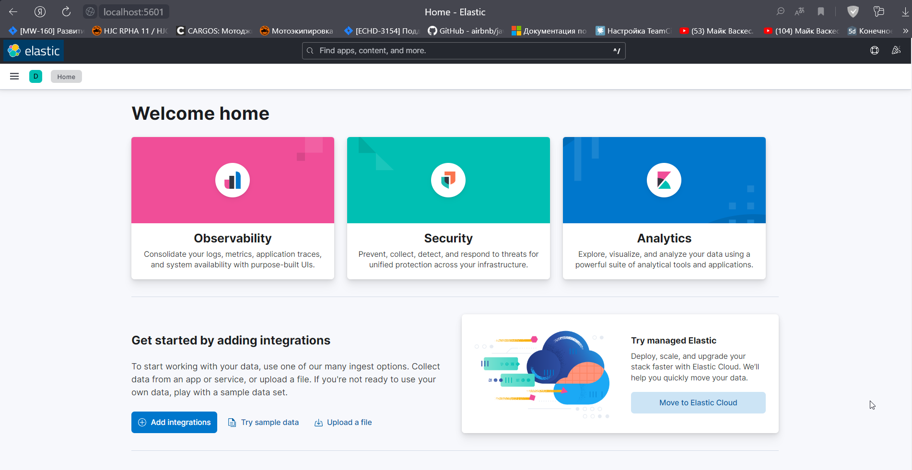
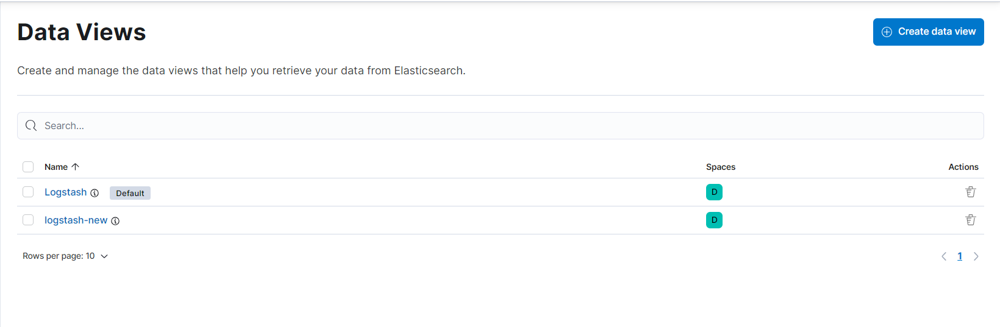
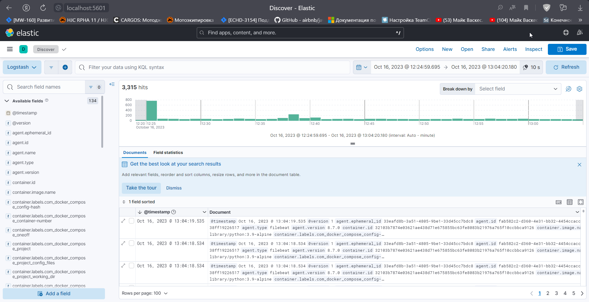
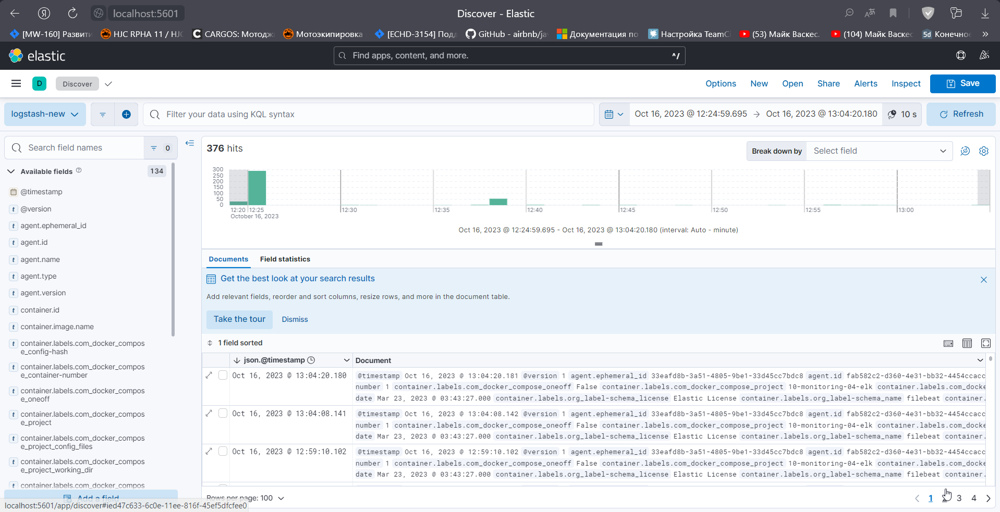

# Домашнее задание к занятию 15 «Система сбора логов Elastic Stack»

<details>
<summary>Дополнительные ссылки</summary>

При выполнении задания используйте дополнительные ресурсы:

- [поднимаем elk в docker](https://www.elastic.co/guide/en/elastic-stack-get-started/current/get-started-docker.html);
- [поднимаем elk в docker с filebeat и docker-логами](https://www.sarulabs.com/post/5/2019-08-12/sending-docker-logs-to-elasticsearch-and-kibana-with-filebeat.html);
- [конфигурируем logstash](https://www.elastic.co/guide/en/logstash/current/configuration.html);
- [плагины filter для logstash](https://www.elastic.co/guide/en/logstash/current/filter-plugins.html);
- [конфигурируем filebeat](https://www.elastic.co/guide/en/beats/libbeat/5.3/config-file-format.html);
- [привязываем индексы из elastic в kibana](https://www.elastic.co/guide/en/kibana/current/index-patterns.html);
- [как просматривать логи в kibana](https://www.elastic.co/guide/en/kibana/current/discover.html);
- [решение ошибки increase vm.max_map_count elasticsearch](https://stackoverflow.com/questions/42889241/how-to-increase-vm-max-map-count).

</details>

## Задание 1

Вам необходимо поднять в докере и связать между собой:

- elasticsearch (hot и warm ноды);
- logstash;
- kibana;
- filebeat.

Logstash следует сконфигурировать для приёма по tcp json-сообщений.
Filebeat следует сконфигурировать для отправки логов docker вашей системы в logstash.

<details>
<summary>Вывод в консоль</summary>
```sh
qwuen@LAPTOP-2QLN04RI:/mnt/c/projects/home/devops-netology/assets/10-monitoring-04-elk$ docker ps -a
CONTAINER ID   IMAGE                    COMMAND                  CREATED          STATUS          PORTS                                                                                            NAMES
a0e893c688a1   kibana:8.7.0             "/bin/tini -- /usr/l…"   3 seconds ago    Up 2 seconds    0.0.0.0:5601->5601/tcp, :::5601->5601/tcp                                                        kibana
38ff19226517   elastic/filebeat:8.7.0   "/usr/bin/tini -- /u…"   13 minutes ago   Up 13 minutes                                                                                                    filebeat
0e978991b000   logstash:8.7.0           "/usr/local/bin/dock…"   13 minutes ago   Up 13 minutes   0.0.0.0:5044->5044/tcp, :::5044->5044/tcp, 0.0.0.0:5046->5046/tcp, :::5046->5046/tcp, 9600/tcp   logstash
2f0e492f70ee   elasticsearch:8.7.0      "/bin/tini -- /usr/l…"   13 minutes ago   Up 13 minutes   0.0.0.0:9200->9200/tcp, :::9200->9200/tcp, 9300/tcp                                              es-hot
9dc0c2f399ae   elasticsearch:8.7.0      "/bin/tini -- /usr/l…"   13 minutes ago   Up 13 minutes   9200/tcp, 9300/tcp                                                                               es-warm
```

</details>

  

## Задание 2

Перейдите в меню [создания index-patterns  в kibana](http://localhost:5601/app/management/kibana/indexPatterns/create) и создайте несколько index-patterns из имеющихся.

Перейдите в меню просмотра логов в kibana (Discover) и самостоятельно изучите, как отображаются логи и как производить поиск по логам.

  

  


 

 
