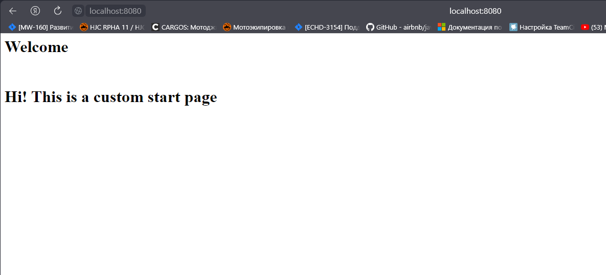

# Домашнее задание к занятию «Конфигурация приложений»


### Инструменты и дополнительные материалы, которые пригодятся для выполнения задания

1. [Описание](https://kubernetes.io/docs/concepts/configuration/secret/) Secret.
2. [Описание](https://kubernetes.io/docs/concepts/configuration/configmap/) ConfigMap.
3. [Описание](https://github.com/wbitt/Network-MultiTool) Multitool.

------

### Задание 1. Создать Deployment приложения и решить возникшую проблему с помощью ConfigMap. Добавить веб-страницу

1. Создать Deployment приложения, состоящего из контейнеров nginx и multitool.
```sh
qwuen@MSI:~$ kubectl create namespace my
namespace/my created
qwuen@MSI:/mnt/d/projects/devops-netology/assets/12-kuber-08/manifests$ ls
configmap.yml  deployment.yml
qwuen@MSI:/mnt/d/projects/devops-netology/assets/12-kuber-08/manifests$ kubectl apply -f deployment.yml -n my
deployment.apps/deployment created
qwuen@MSI:/mnt/d/projects/devops-netology/assets/12-kuber-08/manifests$ kubectl get po -n my
NAME                          READY   STATUS              RESTARTS   AGE
deployment-6bfb7c8784-wwgrn   0/2     ContainerCreating   0          15s
```
2. Решить возникшую проблему с помощью ConfigMap.
```sh 
qwuen@MSI:/mnt/d/projects/devops-netology/assets/12-kuber-08/manifests$ kubectl apply -f configmap.yml -n my
configmap/nginx-configmap created
qwuen@MSI:/mnt/d/projects/devops-netology/assets/12-kuber-08/manifests$ kubectl get po -n my
NAME                          READY   STATUS              RESTARTS   AGE
deployment-6bfb7c8784-wwgrn   0/2     ContainerCreating   0          87s
qwuen@MSI:/mnt/d/projects/devops-netology/assets/12-kuber-08/manifests$ kubectl get po -n my
NAME                          READY   STATUS    RESTARTS   AGE
deployment-6bfb7c8784-wwgrn   2/2     Running   0          3m19s
```
3. Продемонстрировать, что pod стартовал и оба конейнера работают.
4. Сделать простую веб-страницу и подключить её к Nginx с помощью ConfigMap. Подключить Service и показать вывод curl или в браузере.
```sh
qwuen@MSI:/mnt/d/projects/devops-netology/assets/12-kuber-08/manifests$ kubectl apply -f service-nginx.yml -n my
service/nginx-srv created
qwuen@MSI:/mnt/d/projects/devops-netology/assets/12-kuber-08/manifests$ kubectl get svc -n my
NAME        TYPE        CLUSTER-IP       EXTERNAL-IP   PORT(S)   AGE
nginx-srv   ClusterIP   10.152.183.142   <none>        80/TCP    2m1s
qwuen@MSI:/mnt/d/projects/devops-netology/assets/12-kuber-08/manifests$ kubectl port-forward svc/nginx-srv 8080:80 -n my
Forwarding from 127.0.0.1:8080 -> 80
Forwarding from [::1]:8080 -> 80
Handling connection for 8080
Handling connection for 8080
```


5. Предоставить манифесты, а также скриншоты или вывод необходимых команд.

Манифесты:
- [deployment.yml](/assets/12-kuber-08/manifests/deployment.yml)
- [configmap.yml](/assets/12-kuber-08/manifests/configmap.yml)
- [service-nginx.yml](/assets/12-kuber-08/manifests/service-nginx.yml)

------

### Задание 2. Создать приложение с вашей веб-страницей, доступной по HTTPS 

1. Создать Deployment приложения, состоящего из Nginx.
```sh
qwuen@MSI:/mnt/d/projects/devops-netology/assets/12-kuber-08/manifests$ kubectl apply -f deployment-nginx.yml -n my
deployment.apps/deployment-nginx created
qwuen@MSI:/mnt/d/projects/devops-netology/assets/12-kuber-08/manifests$ kubectl get po -n my
NAME                                READY   STATUS    RESTARTS   AGE
deployment-6bfb7c8784-wwgrn         2/2     Running   0          87m
deployment-nginx-58cc74865f-grxdh   1/1     Running   0          92s
```
2. Создать собственную веб-страницу и подключить её как ConfigMap к приложению.
3. Выпустить самоподписной сертификат SSL. Создать Secret для использования сертификата.
4. Создать Ingress и необходимый Service, подключить к нему SSL в вид. Продемонстировать доступ к приложению по HTTPS. 
4. Предоставить манифесты, а также скриншоты или вывод необходимых команд.

------