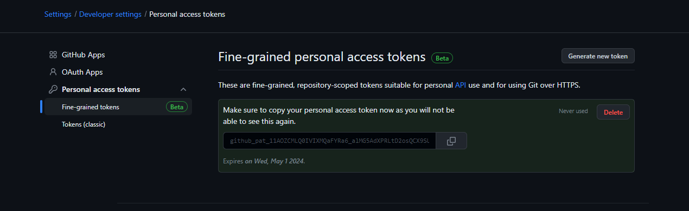

# Тестовые задания

Будут игнорированы:  
- Файлы в директории `.terraform` на любом уровне вложенности
- Файлы с расширением `tfstate` и расширением производным от него  
- Файлы логов `crash.log` и файлы созданные по шаблону `crash.*.log`, где * - любой текст  
- Файлы с расширением `.tfvars` и `.tfvars.json`  
- Файлы с расширением `override.tf` и `override.tf.json`  
- Файлы по шаблону `*_override.tf` и `*_override.tf.json`
- Файлы с расширением `terraformrc`
- Файлы с именем `terraform.rc`  

Созданный токен доступа:  

