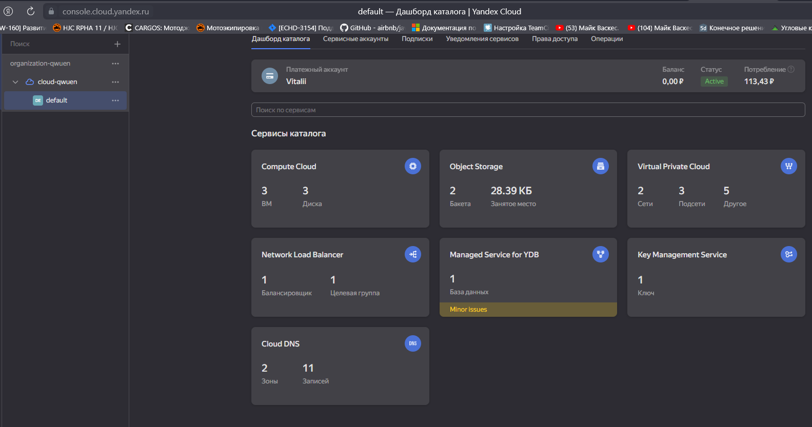
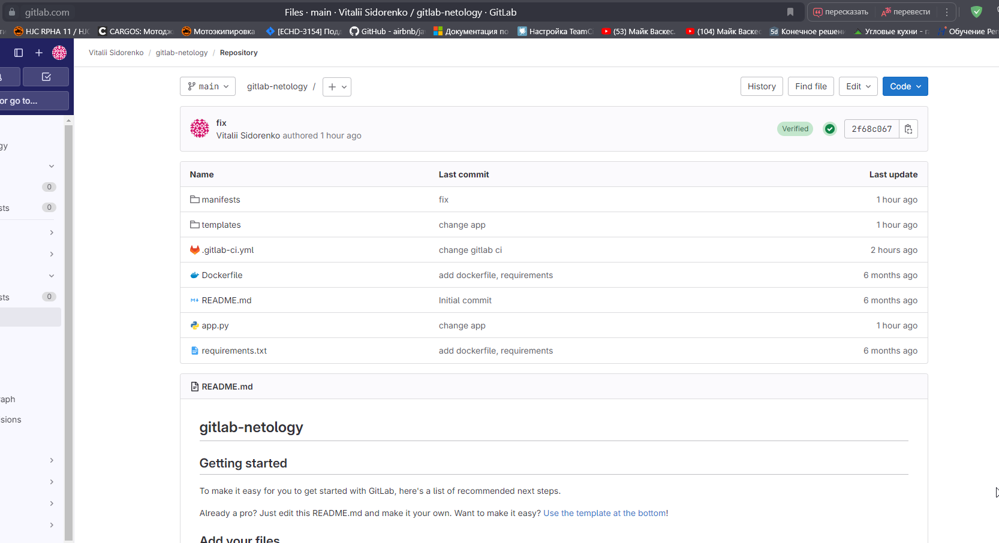
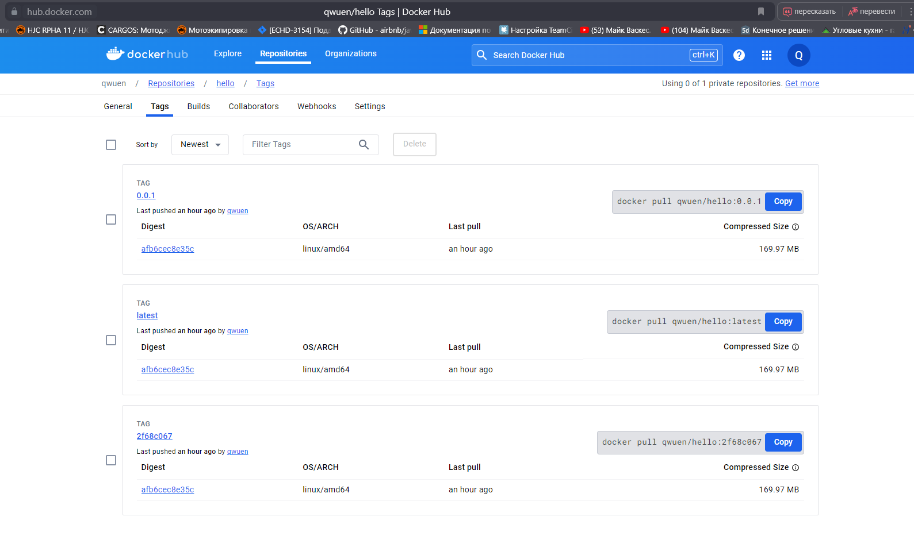
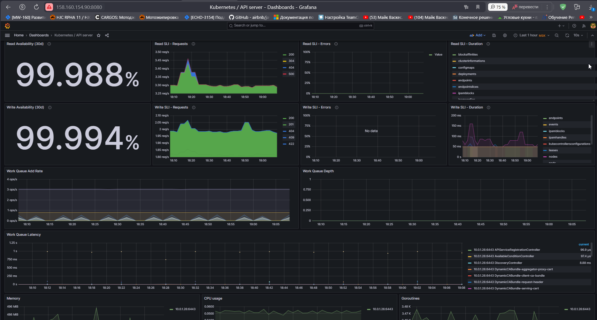
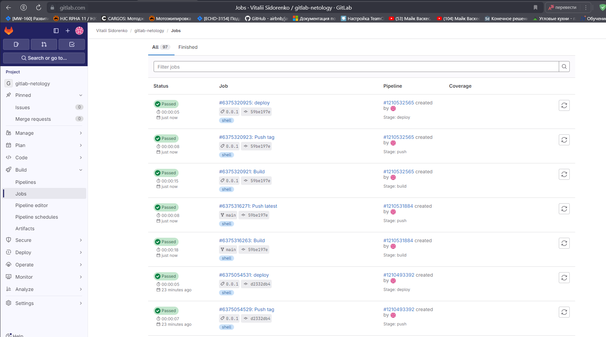

# Дипломный практикум в Yandex.Cloud
  
---
## Цели:

1. Подготовить облачную инфраструктуру на базе облачного провайдера Яндекс.Облако.
2. Запустить и сконфигурировать Kubernetes кластер.
3. Установить и настроить систему мониторинга.
4. Настроить и автоматизировать сборку тестового приложения с использованием Docker-контейнеров.
5. Настроить CI для автоматической сборки и тестирования.
6. Настроить CD для автоматического развёртывания приложения.

---
## Этапы выполнения:


### 1. Создание облачной инфраструктуры

<details>
<summary>Задачи этапа:</summary>

Для начала необходимо подготовить облачную инфраструктуру в ЯО при помощи [Terraform](https://www.terraform.io/).

Особенности выполнения:

- Бюджет купона ограничен, что следует иметь в виду при проектировании инфраструктуры и использовании ресурсов;
Для облачного k8s используйте региональный мастер(неотказоустойчивый). Для self-hosted k8s минимизируйте ресурсы ВМ и долю ЦПУ. В обоих вариантах используйте прерываемые ВМ для worker nodes.
- Следует использовать версию [Terraform](https://www.terraform.io/) не старше 1.5.x .

Предварительная подготовка к установке и запуску Kubernetes кластера.

1. Создайте сервисный аккаунт, который будет в дальнейшем использоваться Terraform для работы с инфраструктурой с необходимыми и достаточными правами. Не стоит использовать права суперпользователя
2. Подготовьте [backend](https://www.terraform.io/docs/language/settings/backends/index.html) для Terraform:  
   а. Рекомендуемый вариант: S3 bucket в созданном ЯО аккаунте(создание бакета через TF)
   б. Альтернативный вариант:  [Terraform Cloud](https://app.terraform.io/)  
3. Создайте VPC с подсетями в разных зонах доступности.
4. Убедитесь, что теперь вы можете выполнить команды `terraform destroy` и `terraform apply` без дополнительных ручных действий.
5. В случае использования [Terraform Cloud](https://app.terraform.io/) в качестве [backend](https://www.terraform.io/docs/language/settings/backends/index.html) убедитесь, что применение изменений успешно проходит, используя web-интерфейс Terraform cloud.

</details>  

Ожидаемые результаты:

1. Terraform сконфигурирован и создание инфраструктуры посредством Terraform возможно без дополнительных ручных действий.
2. Полученная конфигурация инфраструктуры является предварительной, поэтому в ходе дальнейшего выполнения задания возможны изменения.

<details>
<summary>Листинг выполнения команд:</summary>

Разворачивание инфраструктуры:  
```sh
D:\projects\devops-netology\assets\devops-diplom-yandexcloud\terraform>terraform apply
data.yandex_compute_image.ubuntu: Reading...
data.yandex_compute_image.ubuntu: Read complete after 1s [id=fd8c3t86dc563mtmnqce]

Terraform used the selected providers to generate the following execution plan. Resource actions are indicated with the
following symbols:
  + create
  ...
Apply complete! Resources: 10 added, 0 changed, 0 destroyed.

Outputs:

bucket = "Bucket Id - tf-state-sva)"
master_ip = "master - 10.0.1.26(158.160.50.177)"
worker_ips = [
  "worker-0 - 10.0.1.27(178.154.204.90)",
  "worker-1 - 10.0.1.10(178.154.220.48)",
]
ybd = "YBD Id - etnv3e1on912bod7j3b6)"
ybd_endpoint = "YBD endpoint - grpcs://ydb.serverless.yandexcloud.net:2135/?database=/ru-central1/b1gamuvki52hfn7mdg4j/etnv3e1on912bod7j3b6)"
```

Инициализация бэкенда S3
```sh
D:\projects\devops-netology\assets\devops-diplom-yandexcloud\terraform>terraform init -backend-config=secret.backend.tfvars -reconfigure

Initializing the backend...
Do you want to copy existing state to the new backend?
  Enter a value: yes

Releasing state lock. This may take a few moments...

Successfully configured the backend "s3"! Terraform will automatically
use this backend unless the backend configuration changes.

Initializing provider plugins...
- Reusing previous version of yandex-cloud/yandex from the dependency lock file
- Reusing previous version of hashicorp/local from the dependency lock file
- Using previously-installed yandex-cloud/yandex v0.111.0
- Using previously-installed hashicorp/local v2.4.1

Terraform has been successfully initialized!
```

</details>



---
### Создание Kubernetes кластера

<details>
<summary>Задачи этапа:</summary>

На этом этапе необходимо создать [Kubernetes](https://kubernetes.io/ru/docs/concepts/overview/what-is-kubernetes/) кластер на базе предварительно созданной инфраструктуры.   Требуется обеспечить доступ к ресурсам из Интернета.

Это можно сделать двумя способами:

1. Рекомендуемый вариант: самостоятельная установка Kubernetes кластера.  
   а. При помощи Terraform подготовить как минимум 3 виртуальных машины Compute Cloud для создания Kubernetes-кластера. Тип виртуальной машины следует выбрать самостоятельно с учётом требовании к производительности и стоимости. Если в дальнейшем поймете, что необходимо сменить тип инстанса, используйте Terraform для внесения изменений.  
   б. Подготовить [ansible](https://www.ansible.com/) конфигурации, можно воспользоваться, например [Kubespray](https://kubernetes.io/docs/setup/production-environment/tools/kubespray/)  
   в. Задеплоить Kubernetes на подготовленные ранее инстансы, в случае нехватки каких-либо ресурсов вы всегда можете создать их при помощи Terraform.
2. Альтернативный вариант: воспользуйтесь сервисом [Yandex Managed Service for Kubernetes](https://cloud.yandex.ru/services/managed-kubernetes)  
  а. С помощью terraform resource для [kubernetes](https://registry.terraform.io/providers/yandex-cloud/yandex/latest/docs/resources/kubernetes_cluster) создать **региональный** мастер kubernetes с размещением нод в разных 3 подсетях      
  б. С помощью terraform resource для [kubernetes node group](https://registry.terraform.io/providers/yandex-cloud/yandex/latest/docs/resources/kubernetes_node_group)

</details>  
  
Ожидаемый результат:

1. Работоспособный Kubernetes кластер.
2. В файле `~/.kube/config` находятся данные для доступа к кластеру.
3. Команда `kubectl get pods --all-namespaces` отрабатывает без ошибок.

<details>
<summary>Листинг выполнения команд:</summary>

```sh
C:\Users\itsid>ssh ubuntu@158.160.50.177
ubuntu@fhmms5frg4b4hmaufkto:~$ sudo apt install git
ubuntu@fhmms5frg4b4hmaufkto:~$ git clone https://github.com/kubernetes-sigs/kubespray
ubuntu@fhmms5frg4b4hmaufkto:~$ sudo apt install python3.9
ubuntu@fhmms5frg4b4hmaufkto:~$ curl -sS https://bootstrap.pypa.io/get-pip.py | python3.9
ubuntu@fhmms5frg4b4hmaufkto:~$ python3.9 -m pip --version
pip 24.0 from /home/ubuntu/.local/lib/python3.9/site-packages/pip (python 3.9)
ubuntu@fhmms5frg4b4hmaufkto:~$ cd kubespray/
ubuntu@fhmms5frg4b4hmaufkto:~/kubespray$ python3.9 -m pip install -r requirements.txt
Successfully installed MarkupSafe-2.1.3 ansible-8.5.0 ansible-core-2.15.9 cffi-1.16.0 cryptography-41.0.4 importlib-resources-5.0.7 jinja2-3.1.2 jmespath-1.0.1 netaddr-0.9.0 packaging-24.0 pbr-5.11.1 pycparser-2.21 resolvelib-1.0.1 ruamel.yaml-0.17.35 ruamel.yaml.clib-0.2.8
ubuntu@fhmms5frg4b4hmaufkto:~/kubespray$ cp -rfp inventory/sample inventory/mycluster
ubuntu@fhmms5frg4b4hmaufkto:~/kubespray$ declare -a IPS=(10.0.1.26 10.0.1.27 10.0.1.10)
ubuntu@fhmms5frg4b4hmaufkto:~/kubespray$ CONFIG_FILE=inventory/mycluster/hosts.yaml python3.9 contrib/inventory_builder/inventory.py ${IPS[@]}
DEBUG: Adding group all
DEBUG: Adding group kube_control_plane
DEBUG: Adding group kube_node
DEBUG: Adding group etcd
DEBUG: Adding group k8s_cluster
DEBUG: Adding group calico_rr
DEBUG: adding host node1 to group all
DEBUG: adding host node2 to group all
DEBUG: adding host node3 to group all
DEBUG: adding host node1 to group etcd
DEBUG: adding host node2 to group etcd
DEBUG: adding host node3 to group etcd
DEBUG: adding host node1 to group kube_control_plane
DEBUG: adding host node2 to group kube_control_plane
DEBUG: adding host node1 to group kube_node
DEBUG: adding host node2 to group kube_node
DEBUG: adding host node3 to group kube_node

// добавляем на мастер ноду приватный ключ и тестируем подключение
ubuntu@fhmms5frg4b4hmaufkto:~/kubespray$ nano ~/.ssh/id_ed25519
ubuntu@fhmms5frg4b4hmaufkto:~/kubespray$ sudo chmod 700 ~/.ssh/id_ed25519
ubuntu@fhmms5frg4b4hmaufkto:~/kubespray$ ssh ubuntu@10.0.1.27
The authenticity of host '10.0.1.27 (10.0.1.27)' can't be established.
ECDSA key fingerprint is SHA256:GSoUddWj6rPL9DUnLnkXoxg3qBtjcGpj+7p/wVgWBrw.
Are you sure you want to continue connecting (yes/no/[fingerprint])? y
Please type 'yes', 'no' or the fingerprint: yes
Warning: Permanently added '10.0.1.27' (ECDSA) to the list of known hosts.
Welcome to Ubuntu 20.04.6 LTS (GNU/Linux 5.4.0-173-generic x86_64)
ubuntu@fhmlj0l93u0901ql2oph:~$ exit
logout
Connection to 10.0.1.27 closed.

// Добавляем ansible в PATH
ubuntu@fhmms5frg4b4hmaufkto:~/kubespray$ nano ~/.bashrc
export PATH="$PATH:$HOME/.local/bin"
ubuntu@fhmms5frg4b4hmaufkto:~/kubespray$ ubuntu@fhmms5frg4b4hmaufkto:~/kubespray$ source ~/.bashrc
ubuntu@fhmms5frg4b4hmaufkto:~/kubespray$ ansible --version
ansible [core 2.15.9]
  config file = /home/ubuntu/kubespray/ansible.cfg
  configured module search path = ['/home/ubuntu/kubespray/library']
  ansible python module location = /home/ubuntu/.local/lib/python3.9/site-packages/ansible
  ansible collection location = /home/ubuntu/.ansible/collections:/usr/share/ansible/collections
  executable location = /home/ubuntu/.local/bin/ansible
  python version = 3.9.5 (default, Nov 23 2021, 15:27:38) [GCC 9.3.0] (/usr/bin/python3.9)
  jinja version = 3.1.2
  libyaml = False

PLAY RECAP *************************************************************************************************************
node1                      : ok=700  changed=142  unreachable=0    failed=0    skipped=1167 rescued=0    ignored=6
node2                      : ok=507  changed=110  unreachable=0    failed=0    skipped=724  rescued=0    ignored=2
node3                      : ok=507  changed=110  unreachable=0    failed=0    skipped=720  rescued=0    ignored=2

Monday 11 March 2024  15:02:02 +0000 (0:00:00.298)       0:20:35.263 **********
===============================================================================
download : Download_file | Download item ---------------------------------------------------------------------- 240.87s
kubernetes/preinstall : Install packages requirements ---------------------------------------------------------- 42.40s
download : Download_file | Download item ----------------------------------------------------------------------- 37.45s
kubernetes/preinstall : Preinstall | wait for the apiserver to be running -------------------------------------- 32.49s
kubernetes/control-plane : Kubeadm | Initialize first master --------------------------------------------------- 29.16s
network_plugin/calico : Wait for calico kubeconfig to be created ----------------------------------------------- 24.39s
kubernetes/kubeadm : Join to cluster --------------------------------------------------------------------------- 20.48s
etcd : Reload etcd --------------------------------------------------------------------------------------------- 20.47s
container-engine/containerd : Download_file | Download item ---------------------------------------------------- 14.69s
etcdctl_etcdutl : Extract_file | Unpacking archive ------------------------------------------------------------- 14.38s
container-engine/crictl : Download_file | Download item -------------------------------------------------------- 13.58s
container-engine/runc : Download_file | Download item ---------------------------------------------------------- 13.52s
container-engine/nerdctl : Download_file | Download item ------------------------------------------------------- 13.32s
download : Download_container | Download image if required ----------------------------------------------------- 13.03s
etcdctl_etcdutl : Download_file | Download item ---------------------------------------------------------------- 12.75s
download : Download_container | Download image if required ----------------------------------------------------- 12.53s
download : Download_container | Download image if required ----------------------------------------------------- 10.79s
download : Download_container | Download image if required ----------------------------------------------------- 10.21s
container-engine/crictl : Extract_file | Unpacking archive ------------------------------------------------------ 9.92s
download : Download_container | Download image if required ------------------------------------------------------ 9.68s

```

Тестирование работоспособности кластера  
```sh
ubuntu@node1:~$ mkdir $HOME/.kube
ubuntu@node1:~$ sudo cp /etc/kubernetes/admin.conf $HOME/.kube/config
ubuntu@node1:~$ sudo chown $(id -u):$(id -g) $HOME/.kube/config
ubuntu@node1:~$ kubectl get nodes
NAME    STATUS   ROLES           AGE   VERSION
node1   Ready    control-plane   84m   v1.29.2
node2   Ready    <none>          83m   v1.29.2
node3   Ready    <none>          83m   v1.29.2
ubuntu@node1:~$ kubectl get pods --all-namespaces
NAMESPACE     NAME                                       READY   STATUS    RESTARTS      AGE
kube-system   calico-kube-controllers-6c7b7dc5d8-mp6hs   1/1     Running   0             61m
kube-system   calico-node-5jgvd                          1/1     Running   0             62m
kube-system   calico-node-6d97f                          1/1     Running   0             62m
kube-system   calico-node-8lnzn                          1/1     Running   0             62m
kube-system   coredns-69db55dd76-65shw                   1/1     Running   0             60m
kube-system   coredns-69db55dd76-xrf8m                   1/1     Running   0             60m
kube-system   dns-autoscaler-6f4b597d8c-xqkxn            1/1     Running   0             60m
kube-system   kube-apiserver-node1                       1/1     Running   1             63m
kube-system   kube-controller-manager-node1              1/1     Running   2             63m
kube-system   kube-proxy-ksr5d                           1/1     Running   0             62m
kube-system   kube-proxy-nxgzh                           1/1     Running   0             62m
kube-system   kube-proxy-sdhw7                           1/1     Running   0             62m
kube-system   kube-scheduler-node1                       1/1     Running   2 (59m ago)   63m
kube-system   nginx-proxy-node2                          1/1     Running   0             62m
kube-system   nginx-proxy-node3                          1/1     Running   0             62m
kube-system   nodelocaldns-2hrsx                         1/1     Running   0             60m
kube-system   nodelocaldns-fhj2f                         1/1     Running   0             60m
kube-system   nodelocaldns-r5zld                         1/1     Running   0             60m
```

Генерация сертификата:
```sh
root@node1:~/.kube# rm /etc/kubernetes/pki/apiserver.* -f
root@node1:~/.kube# kubeadm init phase certs apiserver --apiserver-cert-extra-sans 10.0.1.26 --apiserver-cert-extra-sans 158.160.50.177 --apiserver-cert-extra-sans localhost
```

</details>

---
### Создание тестового приложения

<details>
<summary>Задачи этапа:</summary>

Для перехода к следующему этапу необходимо подготовить тестовое приложение, эмулирующее основное приложение разрабатываемое вашей компанией.

Способ подготовки:

1. Рекомендуемый вариант:  
   а. Создайте отдельный git репозиторий с простым nginx конфигом, который будет отдавать статические данные.  
   б. Подготовьте Dockerfile для создания образа приложения.  
2. Альтернативный вариант:  
   а. Используйте любой другой код, главное, чтобы был самостоятельно создан Dockerfile.

</details>

Ожидаемый результат:

1. Git репозиторий с тестовым приложением и Dockerfile.
2. Регистри с собранным docker image. В качестве регистри может быть DockerHub или [Yandex Container Registry](https://cloud.yandex.ru/services/container-registry), созданный также с помощью terraform.

Репозиторий с кодом приложения:  
  

Реестр докер образов:  


---
### Подготовка cистемы мониторинга и деплой приложения

<details>
<summary>Задачи этапа:</summary>

Уже должны быть готовы конфигурации для автоматического создания облачной инфраструктуры и поднятия Kubernetes кластера.  
Теперь необходимо подготовить конфигурационные файлы для настройки нашего Kubernetes кластера.

Цель:
1. Задеплоить в кластер [prometheus](https://prometheus.io/), [grafana](https://grafana.com/), [alertmanager](https://github.com/prometheus/alertmanager), [экспортер](https://github.com/prometheus/node_exporter) основных метрик Kubernetes.
2. Задеплоить тестовое приложение, например, [nginx](https://www.nginx.com/) сервер отдающий статическую страницу.

Способ выполнения:
1. Воспользовать пакетом [kube-prometheus](https://github.com/prometheus-operator/kube-prometheus), который уже включает в себя [Kubernetes оператор](https://operatorhub.io/) для [grafana](https://grafana.com/), [prometheus](https://prometheus.io/), [alertmanager](https://github.com/prometheus/alertmanager) и [node_exporter](https://github.com/prometheus/node_exporter). При желании можете собрать все эти приложения отдельно.
2. Для организации конфигурации использовать [qbec](https://qbec.io/), основанный на [jsonnet](https://jsonnet.org/). Обратите внимание на имеющиеся функции для интеграции helm конфигов и [helm charts](https://helm.sh/)
3. Если на первом этапе вы не воспользовались [Terraform Cloud](https://app.terraform.io/), то задеплойте и настройте в кластере [atlantis](https://www.runatlantis.io/) для отслеживания изменений инфраструктуры. Альтернативный вариант 3 задания: вместо Terraform Cloud или atlantis настройте на автоматический запуск и применение конфигурации terraform из вашего git-репозитория в выбранной вами CI-CD системе при любом комите в main ветку. Предоставьте скриншоты работы пайплайна из CI/CD системы.

</details>

Ожидаемый результат:
1. Git репозиторий с конфигурационными файлами для настройки Kubernetes.
2. Http доступ к web интерфейсу grafana.
3. Дашборды в grafana отображающие состояние Kubernetes кластера.
4. Http доступ к тестовому приложению.

<details>
<summary>Листинг команд:</summary>

```sh
ubuntu@node1:~$ curl -fsSL -o get_helm.sh https://raw.githubusercontent.com/helm/helm/main/scripts/get-helm-3
ubuntu@node1:~$ ls
get_helm.sh  kubespray
ubuntu@node1:~$ chmod 700 get_helm.sh
ubuntu@node1:~$ ./get_helm.sh
Downloading https://get.helm.sh/helm-v3.14.2-linux-amd64.tar.gz
Verifying checksum... Done.
Preparing to install helm into /usr/local/bin
helm installed into /usr/local/bin/helm
ubuntu@node1:~$ helm version
version.BuildInfo{Version:"v3.14.2", GitCommit:"c309b6f0ff63856811846ce18f3bdc93d2b4d54b", GitTreeState:"clean", GoVersion:"go1.21.7"}
ubuntu@node1:~$ helm repo add prometheus-community https://prometheus-community.github.io/helm-charts
"prometheus-community" has been added to your repositories
ubuntu@node1:~$ helm repo update
Hang tight while we grab the latest from your chart repositories...
...Successfully got an update from the "prometheus-community" chart repository
Update Complete. ⎈Happy Helming!⎈
ubuntu@node1:~/helm$ nano values.yaml
ubuntu@node1:~/helm$ helm upgrade --install --atomic kube-prom-stack prometheus-community/kube-prometheus-stack --namespace monitoring --create-namespace -f values.yaml
Release "kube-prom-stack" does not exist. Installing it now.
NAME: kube-prom-stack
LAST DEPLOYED: Mon Mar 11 17:16:09 2024
NAMESPACE: monitoring
STATUS: deployed
REVISION: 1
NOTES:
kube-prometheus-stack has been installed. Check its status by running:
  kubectl --namespace monitoring get pods -l "release=kube-prom-stack"

Visit https://github.com/prometheus-operator/kube-prometheus for instructions on how to create & configure Alertmanager and Prometheus instances using the Operator.
ubuntu@node1:~/helm$ kubectl --namespace monitoring get all
NAME                                                         READY   STATUS    RESTARTS   AGE
pod/alertmanager-kube-prom-stack-kube-prome-alertmanager-0   2/2     Running   0          9m43s
pod/kube-prom-stack-grafana-58b5c44597-8hnxk                 3/3     Running   0          9m59s
pod/kube-prom-stack-kube-prome-operator-7fc55f7cdb-jtn58     1/1     Running   0          9m59s
pod/kube-prom-stack-kube-state-metrics-c59568b7f-ggdvw       1/1     Running   0          9m59s
pod/kube-prom-stack-prometheus-node-exporter-6k58w           1/1     Running   0          9m58s
pod/kube-prom-stack-prometheus-node-exporter-fbqqj           1/1     Running   0          9m58s
pod/kube-prom-stack-prometheus-node-exporter-slhkz           1/1     Running   0          9m58s
pod/prometheus-kube-prom-stack-kube-prome-prometheus-0       2/2     Running   0          9m42s

NAME                                               TYPE        CLUSTER-IP      EXTERNAL-IP   PORT(S)                         AGE
service/alertmanager-operated                      ClusterIP   None            <none>        9093/TCP,9094/TCP,9094/UDP      9m44s
service/kube-prom-stack-grafana                    NodePort    10.233.41.185   <none>        80:30680/TCP                    9m59s
service/kube-prom-stack-kube-prome-alertmanager    NodePort    10.233.24.141   <none>        9093:30903/TCP,8080:30979/TCP   9m59s
service/kube-prom-stack-kube-prome-operator        ClusterIP   10.233.16.12    <none>        443/TCP                         9m59s
service/kube-prom-stack-kube-prome-prometheus      NodePort    10.233.37.166   <none>        9090:30090/TCP,8080:32018/TCP   9m59s
service/kube-prom-stack-kube-state-metrics         ClusterIP   10.233.19.32    <none>        8080/TCP                        9m59s
service/kube-prom-stack-prometheus-node-exporter   ClusterIP   10.233.23.154   <none>        9100/TCP                        9m59s
service/prometheus-operated                        ClusterIP   None            <none>        9090/TCP                        9m44s

NAME                                                      DESIRED   CURRENT   READY   UP-TO-DATE   AVAILABLE   NODE SELECTOR            AGE
daemonset.apps/kube-prom-stack-prometheus-node-exporter   3         3         3       3            3           kubernetes.io/os=linux   9m59s

NAME                                                  READY   UP-TO-DATE   AVAILABLE   AGE
deployment.apps/kube-prom-stack-grafana               1/1     1            1           9m59s
deployment.apps/kube-prom-stack-kube-prome-operator   1/1     1            1           9m59s
deployment.apps/kube-prom-stack-kube-state-metrics    1/1     1            1           9m59s

NAME                                                             DESIRED   CURRENT   READY   AGE
replicaset.apps/kube-prom-stack-grafana-58b5c44597               1         1         1       9m59s
replicaset.apps/kube-prom-stack-kube-prome-operator-7fc55f7cdb   1         1         1       9m59s
replicaset.apps/kube-prom-stack-kube-state-metrics-c59568b7f     1         1         1       9m59s

NAME                                                                    READY   AGE
statefulset.apps/alertmanager-kube-prom-stack-kube-prome-alertmanager   1/1     9m44s
statefulset.apps/prometheus-kube-prom-stack-kube-prome-prometheus       1/1     9m43s
```

Установка ingress. В итоге не стал использовать, требовалось время на получение доменного имени.  

```sh
ubuntu@node1:~$ helm repo add ingress-nginx https://kubernetes.github.io/ingress-nginx
"ingress-nginx" has been added to your repositories
ubuntu@node1:~$ helm repo update
Hang tight while we grab the latest from your chart repositories...
...Successfully got an update from the "ingress-nginx" chart repository
...Successfully got an update from the "prometheus-community" chart repository
Update Complete. ⎈Happy Helming!⎈
helm upgrade --install ingress-nginx ingress-nginx \
  --repo https://kubernetes.github.io/ingress-nginx \
  --namespace ingress-nginx --create-namespace \
  --set controller.metrics.enabled=true \
  --set controller.metrics.serviceMonitor.enabled=true \
  --set controller.metrics.serviceMonitor.additionalLabels.release="kube-prometheus-stack"
```

</details>

Интерфейс grafana:  


---
### Установка и настройка CI/CD

<details>
<summary>Задачи этапа:</summary>

Осталось настроить ci/cd систему для автоматической сборки docker image и деплоя приложения при изменении кода.

Цель:

1. Автоматическая сборка docker образа при коммите в репозиторий с тестовым приложением.
2. Автоматический деплой нового docker образа.

Можно использовать [teamcity](https://www.jetbrains.com/ru-ru/teamcity/), [jenkins](https://www.jenkins.io/), [GitLab CI](https://about.gitlab.com/stages-devops-lifecycle/continuous-integration/) или GitHub Actions.

</details>


Ожидаемый результат:

1. Интерфейс ci/cd сервиса доступен по http.
2. При любом коммите в репозиторие с тестовым приложением происходит сборка и отправка в регистр Docker образа.
3. При создании тега (например, v1.0.0) происходит сборка и отправка с соответствующим label в регистри, а также деплой соответствующего Docker образа в кластер Kubernetes.



---

## Что необходимо для сдачи задания?

1. Репозиторий с конфигурационными файлами Terraform и готовность продемонстрировать создание всех ресурсов с нуля.  
[Файлы terraform](assets/devops-diplom-yandexcloud/terraform/)  

2. Пример pull request с комментариями созданными atlantis'ом или снимки экрана из Terraform Cloud или вашего CI-CD-terraform pipeline.  
[gitlab-ci.yml](https://gitlab.com/qwuens/gitlab-netology/-/blob/main/.gitlab-ci.yml?ref_type=heads)  

3. Репозиторий с конфигурацией ansible, если был выбран способ создания Kubernetes кластера при помощи ansible.  
[Kubespray inventory hosts.yaml](assets/devops-diplom-yandexcloud/ansible/hosts.yaml)  

4. Репозиторий с Dockerfile тестового приложения и ссылка на собранный docker image.  
[Application gitlab](https://gitlab.com/qwuens/gitlab-netology.git)  
[Application docker hub](https://hub.docker.com/repository/docker/qwuen/hello/general)
5. Репозиторий с конфигурацией Kubernetes кластера.
6. Ссылка на тестовое приложение и веб интерфейс Grafana с данными доступа.  
[Grafana](http://158.160.154.90:8080/d/09ec8aa1e996d6ffcd6817bbaff4db1b/kubernetes-api-server?orgId=1&refresh=10s)  
[Application](http://158.160.154.90/hello/Netology)
7. Все репозитории рекомендуется хранить на одном ресурсе (github, gitlab)  
[Файлы дипломного проекта](assets/devops-diplom-yandexcloud/)  
