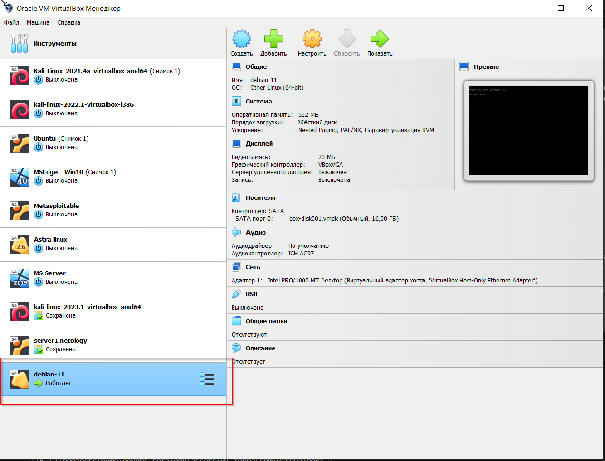

# Домашнее задание к занятию «Введение в Terraform»

### Инструменты и дополнительные материалы, которые пригодятся для выполнения задания

1. Установка и настройка Terraform  [ссылка](https://cloud.yandex.ru/docs/tutorials/infrastructure-management/terraform-quickstart#from-yc-mirror)
2. Зеркало документации Terraform  [ссылка](https://registry.tfpla.net/browse/providers) 
3. Установка docker [ссылка](https://docs.docker.com/engine/install/ubuntu/) 
------

### Задание 1

1. Перейдите в каталог [**src**](https://github.com/netology-code/ter-homeworks/tree/main/01/src). Скачайте все необходимые зависимости, использованные в проекте.  
```
PS C:\projects\home\ter-homeworks\01\src> terraform init

Initializing the backend...

Initializing provider plugins...
- Finding kreuzwerker/docker versions matching "~> 3.0.1"...
- Finding latest version of hashicorp/random...
- Installing kreuzwerker/docker v3.0.2...
- Installed kreuzwerker/docker v3.0.2 (unauthenticated)
- Installing hashicorp/random v3.5.1...
- Installed hashicorp/random v3.5.1 (unauthenticated)

Terraform has created a lock file .terraform.lock.hcl to record the provider
selections it made above. Include this file in your version control repository
so that Terraform can guarantee to make the same selections by default when
you run "terraform init" in the future.

╷
│ Warning: Incomplete lock file information for providers
│
│ Due to your customized provider installation methods, Terraform was forced to calculate lock file checksums locally for the following providers:
│   - hashicorp/random
│   - kreuzwerker/docker
│
│ The current .terraform.lock.hcl file only includes checksums for windows_amd64, so Terraform running on another platform will fail to install these providers.      
│
│ To calculate additional checksums for another platform, run:
│   terraform providers lock -platform=linux_amd64
│ (where linux_amd64 is the platform to generate)
╵

Terraform has been successfully initialized!

You may now begin working with Terraform. Try running "terraform plan" to see
any changes that are required for your infrastructure. All Terraform commands
should now work.

If you ever set or change modules or backend configuration for Terraform,
rerun this command to reinitialize your working directory. If you forget, other
commands will detect it and remind you to do so if necessary.
```

2. Изучите файл **.gitignore**. В каком terraform файле согласно этому .gitignore допустимо сохранить личную, секретную информацию?
```
# own secret vars store.
personal.auto.tfvars
```

3. Выполните код проекта. Найдите  в State-файле секретное содержимое созданного ресурса **random_password**, пришлите в качестве ответа конкретный ключ и его значение.
```
 "result": "XDrIprxi9q2ybNTa"
```

4. Раскомментируйте блок кода, примерно расположенный на строчках 29-42 файла **main.tf**.
Выполните команду ```terraform validate```. Объясните в чем заключаются намеренно допущенные ошибки? Исправьте их.
```
PS C:\projects\home\ter-homeworks\01\src> terraform validate
╷
│ Error: Missing name for resource
│
│   on main.tf line 23, in resource "docker_image":
│   23: resource "docker_image" {
│
│ All resource blocks must have 2 labels (type, name).
╵
╷
│ Error: Invalid resource name
│
│   on main.tf line 28, in resource "docker_container" "1nginx":
│   28: resource "docker_container" "1nginx" {
│
│ A name must start with a letter or underscore and may contain only letters, digits, underscores, and dashes.
```
Ошибки:  
- При объявлении ресурса docker_image пропущен параметр `name`
- Ошибка при обращении к ресурсу `random_password.random_string_fake.resuld`  
- Невалидное имя контейнера `1nginx`, т.к. начинается с числа  


5. Выполните код. В качестве ответа приложите вывод команды ```docker ps```  
```
PS C:\projects\home\ter-homeworks\01\src> terraform apply   
random_password.random_string: Refreshing state... [id=none]
...
docker_image.nginx: Creating...
docker_image.nginx: Still creating... [10s elapsed]
docker_image.nginx: Still creating... [20s elapsed]
docker_image.nginx: Still creating... [30s elapsed]
docker_image.nginx: Creation complete after 35s [id=sha256:f9c14fe76d502861ba0939bc3189e642c02e257f06f4c0214b1f8ca329326cdanginx:latest]
docker_container.nginx: Creating...
docker_container.nginx: Creation complete after 3s [id=e708e7761e6523c9f28885779cd88a5a96013d83cbf9be54a6a5ea1ba68cb1bf]

Apply complete! Resources: 2 added, 0 changed, 0 destroyed.
```
```
PS C:\projects\home\ter-homeworks\01\src> docker ps
CONTAINER ID   IMAGE          COMMAND                  CREATED              STATUS              PORTS                  NAMES
e708e7761e65   f9c14fe76d50   "/docker-entrypoint.…"   About a minute ago   Up About a minute   0.0.0.0:8000->80/tcp   example_XDrIprxi9q2ybNTa
```
6. Замените имя docker-контейнера в блоке кода на ```hello_world```, выполните команду ```terraform apply -auto-approve```.
Объясните своими словами, в чем может быть опасность применения ключа  ```-auto-approve``` ? В качестве ответа дополнительно приложите вывод команды ```docker ps```
```
PS C:\projects\home\ter-homeworks\01\src> docker ps
CONTAINER ID   IMAGE          COMMAND                  CREATED         STATUS         PORTS                  NAMES
f06026f825dd   f9c14fe76d50   "/docker-entrypoint.…"   3 minutes ago   Up 3 minutes   0.0.0.0:8000->80/tcp   hello_world
```  
-auto-approve: Пропускает интерактивное одобрение плана развертывания.  

8. Уничтожьте созданные ресурсы с помощью **terraform**. Убедитесь, что все ресурсы удалены. Приложите содержимое файла **terraform.tfstate**.  
```
{
  "version": 4,
  "terraform_version": "1.4.6",
  "serial": 11,
  "lineage": "191fa340-83b0-0273-4092-27b00d35a76c",
  "outputs": {},
  "resources": [],
  "check_results": null
}
```
9. Объясните, почему при этом не был удален docker образ **nginx:latest** ? Ответ подкрепите выдержкой из документации провайдера.  
В main.tf присутвует параметр keep_locally = true Согласно документации провайдера, если стои true то он не будет удален
```
keep_locally (Boolean) If true, then the Docker image won't be deleted on destroy operation. If this is false, it will delete the image from the docker local storage on destroy operation.
```
------

## Дополнительные задания (со звездочкой*)

**Настоятельно рекомендуем выполнять все задания под звёздочкой.**   Их выполнение поможет глубже разобраться в материале.   
Задания под звёздочкой дополнительные (необязательные к выполнению) и никак не повлияют на получение вами зачета по этому домашнему заданию. 

### Задание 2*

1. Изучите в документации provider [**Virtualbox**](https://registry.tfpla.net/providers/shekeriev/virtualbox/latest/docs/overview/index) от 
shekeriev.
2. Создайте с его помощью любую виртуальную машину. Чтобы не использовать VPN советуем выбрать любой образ с расположением в github из [**списка**](https://www.vagrantbox.es/)

В качестве ответа приложите plan для создаваемого ресурса и скриншот созданного в VB ресурса. 
```
PS C:\projects\home\devops-netology\assets\01-terraform\vitrualbox> terraform apply

Terraform used the selected providers to generate the following execution plan. Resource actions are indicated with the following symbols:
  + create

Terraform will perform the following actions:

  # virtualbox_vm.vm1 will be created
  + resource "virtualbox_vm" "vm1" {
      + cpus   = 1
      + id     = (known after apply)
      + image  = "./virtualbox.box"
      + memory = "512 mib"
      + name   = "debian-11"
      + status = "running"

      + network_adapter {
          + device                 = "IntelPro1000MTDesktop"
          + host_interface         = "VirtualBox Host-Only Ethernet Adapter"
          + ipv4_address           = (known after apply)
          + ipv4_address_available = (known after apply)
          + mac_address            = (known after apply)
          + status                 = (known after apply)
          + type                   = "hostonly"
        }
    }

Plan: 1 to add, 0 to change, 0 to destroy.

Changes to Outputs:
  + IPAddress = (known after apply)

Do you want to perform these actions?
  Terraform will perform the actions described above.
  Only 'yes' will be accepted to approve.

  Enter a value: yes

virtualbox_vm.vm1: Creating...
virtualbox_vm.vm1: Still creating... [10s elapsed]
virtualbox_vm.vm1: Still creating... [20s elapsed]
virtualbox_vm.vm1: Still creating... [30s elapsed]
virtualbox_vm.vm1: Still creating... [40s elapsed]
virtualbox_vm.vm1: Still creating... [50s elapsed]
virtualbox_vm.vm1: Still creating... [1m0s elapsed]
virtualbox_vm.vm1: Still creating... [1m10s elapsed]
virtualbox_vm.vm1: Still creating... [1m20s elapsed]
virtualbox_vm.vm1: Still creating... [1m30s elapsed]
virtualbox_vm.vm1: Creation complete after 1m37s [id=11919375-1c40-452e-8bce-eba02f52e767]

Apply complete! Resources: 1 added, 0 changed, 0 destroyed.

Outputs:

IPAddress = "192.168.56.107"
```

