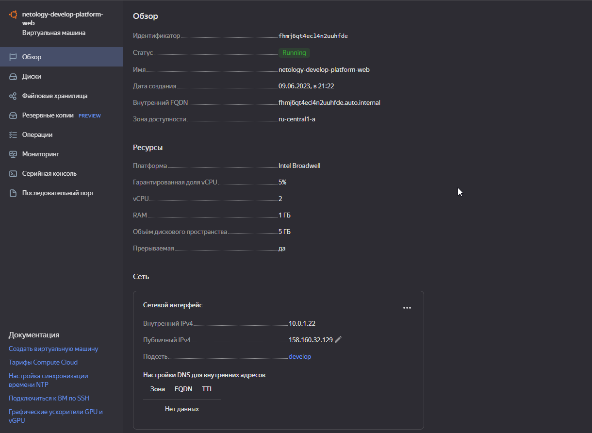
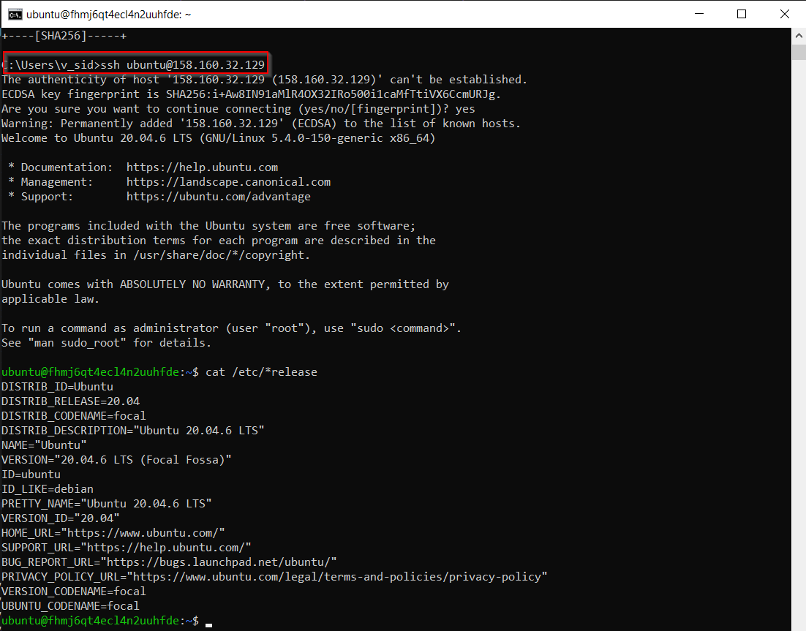

# Домашнее задание к занятию «Основы Terraform. Yandex Cloud»

### Задание 1

Ошибка выполнения команды apply говорит о том, что для платформы "standard-v1" доступны ВМ с количеством ядер 2 и 4
```
│ Error: Error while requesting API to create instance: server-request-id = 5b232f15-793b-43c2-85d2-a63547a58a71 server-trace-id = d5d3c5357503d235:a239c9e3fa535e3a:d5d3c5357503d235:1 client-request-id = a0cddceb-0f6a-41d1-84ea-62adca844f5f client-trace-id = d4b78646-0817-4a97-9d5a-fe72ab30d112 rpc error: code = InvalidArgument desc = the specified number of cores is not available on platform "standard-v1"; allowed core number: 2, 4     
│
│   with yandex_compute_instance.platform,
│   on main.tf line 15, in resource "yandex_compute_instance" "platform":
│   15: resource "yandex_compute_instance" "platform" {
│
╵
```

Параметр ```preemptible = true``` указывает провайдеру сделать виртуальную машину [прерываемой](https://cloud.yandex.ru/docs/compute/operations/vm-create/create-preemptible-vm#create-preemptible)
Параметр ```core_fraction=5``` устанавливает [уровень производительности](https://cloud.yandex.ru/docs/compute/concepts/performance-levels) vCPU в процентах.  
В учебных целях не требуется большой производительности, тем самым можно сэкономить средства.  

  

  


### Задание 2

1. Изучите файлы проекта.
2. Замените все "хардкод" **значения** для ресурсов **yandex_compute_image** и **yandex_compute_instance** на **отдельные** переменные. К названиям переменных ВМ добавьте в начало префикс **vm_web_** .  Пример: **vm_web_name**.
2. Объявите нужные переменные в файле variables.tf, обязательно указывайте тип переменной. Заполните их **default** прежними значениями из main.tf. 
3. Проверьте terraform plan (изменений быть не должно). 

```
PS C:\projects\home\devops-netology\assets\terraform-02-syntax\src> terraform plan 
yandex_vpc_network.develop: Refreshing state... [id=enpto914lsn87dm0cgq5]
data.yandex_compute_image.ubuntu: Reading...
data.yandex_compute_image.ubuntu: Read complete after 1s [id=fd83vhe8fsr4pe98v6oj]
yandex_vpc_subnet.develop: Refreshing state... [id=e9bv4suv88ecktt912m4]
yandex_compute_instance.platform: Refreshing state... [id=fhmj6qt4ecl4n2uuhfde]

No changes. Your infrastructure matches the configuration.

Terraform has compared your real infrastructure against your configuration and found no differences, so no changes are needed.
```

### Задание 3

1. Создайте в корне проекта файл 'vms_platform.tf' . Перенесите в него все переменные первой ВМ.
2. Скопируйте блок ресурса и создайте с его помощью вторую ВМ(в файле main.tf): **"netology-develop-platform-db"** ,  cores  = 2, memory = 2, core_fraction = 20. Объявите ее переменные с префиксом **vm_db_** в том же файле('vms_platform.tf').
3. Примените изменения.
```
PS C:\projects\home\devops-netology\assets\terraform-02-syntax\src> terraform apply
data.yandex_compute_image.ubuntu: Reading...
yandex_vpc_network.develop: Refreshing state... [id=enpto914lsn87dm0cgq5]
data.yandex_compute_image.ubuntu: Read complete after 0s [id=fd83vhe8fsr4pe98v6oj]
yandex_vpc_subnet.develop: Refreshing state... [id=e9bv4suv88ecktt912m4]
yandex_compute_instance.platform: Refreshing state... [id=fhmj6qt4ecl4n2uuhfde]

Terraform used the selected providers to generate the following execution plan. Resource actions are indicated with the following symbols:
  + create

...

Plan: 1 to add, 0 to change, 0 to destroy.

Do you want to perform these actions?
  Terraform will perform the actions described above.
  Only 'yes' will be accepted to approve.

  Enter a value: yes

yandex_compute_instance.platform-db: Creating...
yandex_compute_instance.platform-db: Still creating... [10s elapsed]
yandex_compute_instance.platform-db: Still creating... [20s elapsed]
yandex_compute_instance.platform-db: Still creating... [30s elapsed]
yandex_compute_instance.platform-db: Creation complete after 40s [id=fhm476vb8tu5r5e1u2ca]

Apply complete! Resources: 1 added, 0 changed, 0 destroyed.
```

### Задание 4

1. Объявите в файле outputs.tf output типа map, содержащий { instance_name = external_ip } для каждой из ВМ.
2. Примените изменения.

```
Outputs:

external_ip_addresses = {
  "netology-develop-platform-db" = "84.201.131.3"
  "netology-develop-platform-web" = "158.160.32.129"
}
```


### Задание 5

1. В файле locals.tf опишите в **одном** local-блоке имя каждой ВМ, используйте интерполяцию ${..} с несколькими переменными по примеру из лекции.
2. Замените переменные с именами ВМ из файла variables.tf на созданные вами local переменные.
3. Примените изменения.
```
PS C:\projects\home\devops-netology\assets\terraform-02-syntax\src> terraform apply
data.yandex_compute_image.ubuntu: Reading...
yandex_vpc_network.develop: Refreshing state... [id=enpto914lsn87dm0cgq5]
data.yandex_compute_image.ubuntu: Read complete after 0s [id=fd83vhe8fsr4pe98v6oj]
yandex_vpc_subnet.develop: Refreshing state... [id=e9bv4suv88ecktt912m4]
yandex_compute_instance.platform: Refreshing state... [id=fhmj6qt4ecl4n2uuhfde]
yandex_compute_instance.platform-db: Refreshing state... [id=fhm476vb8tu5r5e1u2ca]

No changes. Your infrastructure matches the configuration.

Terraform has compared your real infrastructure against your configuration and found no differences, so no changes are needed.

Apply complete! Resources: 0 added, 0 changed, 0 destroyed.

Outputs:

external_ip_addresses = {
  "netology-develop--platform-db" = "84.201.131.3"
  "netology-develop--platform-web" = "158.160.32.129"
}
```

### Задание 6

1. Вместо использования 3-х переменных  ".._cores",".._memory",".._core_fraction" в блоке  resources {...}, объедените их в переменные типа **map** с именами "vm_web_resources" и "vm_db_resources".
2. Так же поступите с блоком **metadata {serial-port-enable, ssh-keys}**, эта переменная должна быть общая для всех ваших ВМ.
3. Найдите и удалите все более не используемые переменные проекта.
4. Проверьте terraform plan (изменений быть не должно).

```
PS C:\projects\home\devops-netology\assets\terraform-02-syntax\src> terraform plan
data.yandex_compute_image.ubuntu: Reading...
yandex_vpc_network.develop: Refreshing state... [id=enpto914lsn87dm0cgq5]
data.yandex_compute_image.ubuntu: Read complete after 0s [id=fd83vhe8fsr4pe98v6oj]
yandex_vpc_subnet.develop: Refreshing state... [id=e9bv4suv88ecktt912m4]
yandex_compute_instance.platform: Refreshing state... [id=fhmj6qt4ecl4n2uuhfde]
yandex_compute_instance.platform-db: Refreshing state... [id=fhm476vb8tu5r5e1u2ca]

No changes. Your infrastructure matches the configuration.

Terraform has compared your real infrastructure against your configuration and found no differences, so no changes are needed.
```

------

### Задание 7*

Изучите содержимое файла console.tf. Откройте terraform console, выполните следующие задания: 

1. Напишите, какой командой можно отобразить **второй** элемент списка test_list?
2. Найдите длину списка test_list с помощью функции length(<имя переменной>).
3. Напишите, какой командой можно отобразить значение ключа admin из map test_map ?
4. Напишите interpolation выражение, результатом которого будет: "John is admin for production server based on OS ubuntu-20-04 with X vcpu, Y ram and Z virtual disks", используйте данные из переменных test_list, test_map, servers и функцию length() для подстановки значений.

```
PS C:\projects\home\devops-netology\assets\terraform-02-syntax\src> terraform console
> local.test_list.1
"staging"
> length(local.test_list)
3
> local.test_map["admin"]
> "${local.test_map["admin"]} is admin for production server based on OS ${local.servers.production.image} with ${local.servers.production.cpu} vcpu, ${local.servers.production.ram} ram and ${length(local.servers.production.disks)} virtual disks"
"John is admin for production server based on OS ubuntu-20-04 with 10 vcpu, 40 ram and 4 virtual disks"
>
```