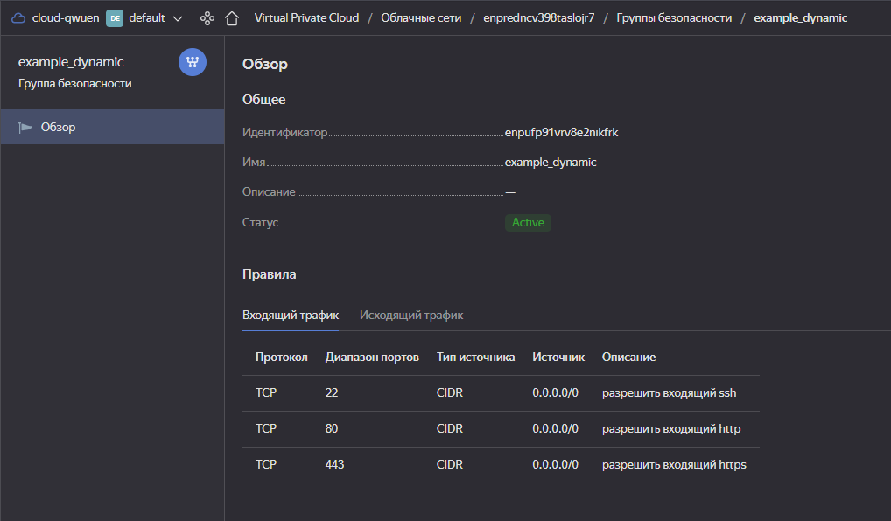
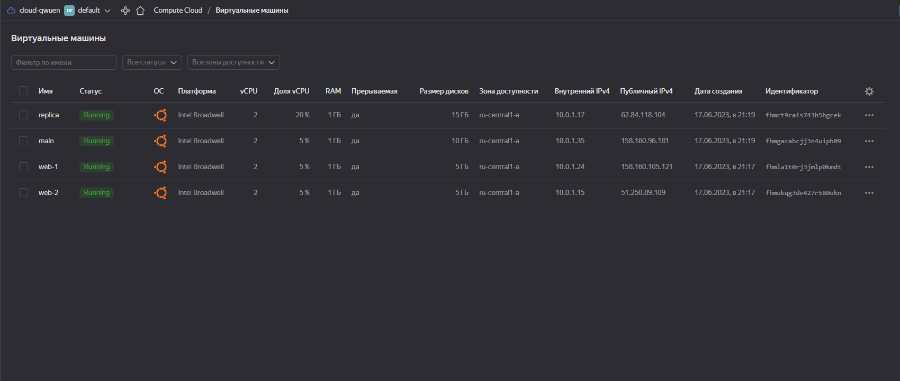
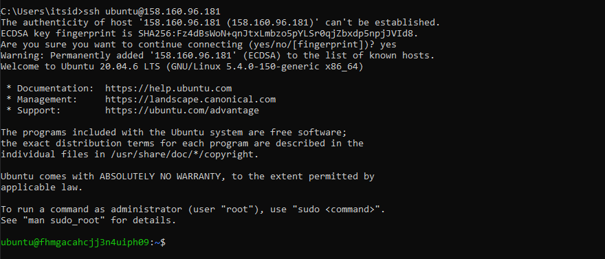
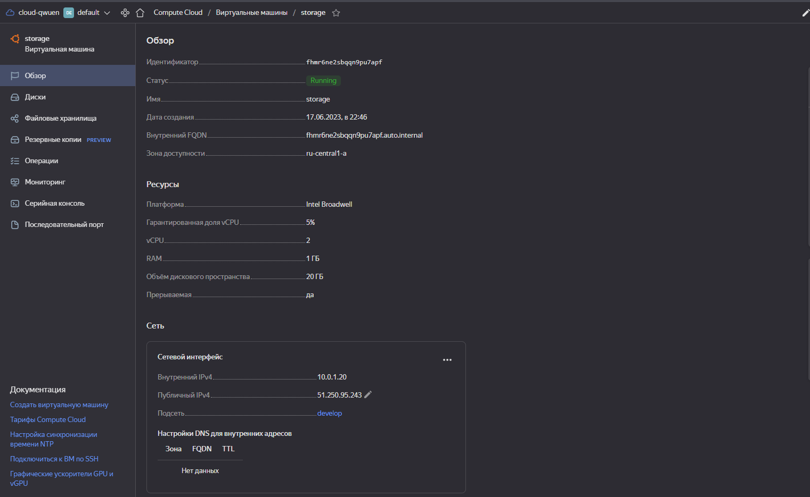
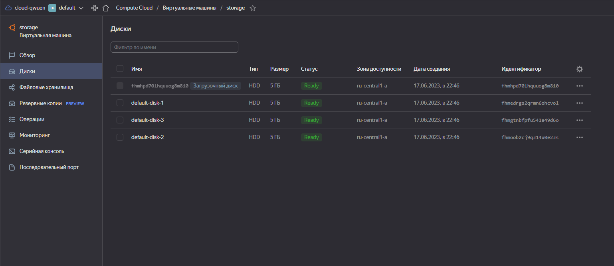

# Домашнее задание к занятию "Управляющие конструкции в коде Terraform"

### Инструменты/ дополнительные материалы, которые пригодятся для выполнения задания

1. [Консоль управления Yandex Cloud](https://console.cloud.yandex.ru/folders/<cloud_id>/vpc/security-groups).
2. [Группы безопасности](https://cloud.yandex.ru/docs/vpc/concepts/security-groups?from=int-console-help-center-or-nav).
3. [Datasource compute disk](https://terraform-eap.website.yandexcloud.net/docs/providers/yandex/d/datasource_compute_disk.html).


### Задание 1

Приложите скриншот входящих правил "Группы безопасности" в ЛК Yandex Cloud.

  

<details>
<summary>Вывод консоли</summary>

```
PS D:\projects\devops-netology\assets\terraform-03-control-structures\src> terraform apply 

Terraform used the selected providers to generate the following execution plan. Resource actions are indicated with the following symbols:
  + create

...

Plan: 3 to add, 0 to change, 0 to destroy.

Do you want to perform these actions?
  Terraform will perform the actions described above.
  Only 'yes' will be accepted to approve.

  Enter a value: yes

yandex_vpc_network.develop: Creating...
yandex_vpc_network.develop: Creation complete after 1s [id=enpredncv398taslojr7]
yandex_vpc_subnet.develop: Creating...
yandex_vpc_security_group.example: Creating...
yandex_vpc_subnet.develop: Creation complete after 0s [id=e9bfgpik2rb0jlgp3gvp]
yandex_vpc_security_group.example: Creation complete after 1s [id=enpufp91vrv8e2nikfrk]

Apply complete! Resources: 3 added, 0 changed, 0 destroyed.
```   
</details>

------

### Задание 2

1. Создайте файл count-vm.tf. Опишите в нем создание двух **одинаковых** ВМ  web-1 и web-2(не web-0 и web-1!), с минимальными параметрами, используя мета-аргумент **count loop**. Назначьте ВМ созданную в 1-м задании группу безопасности.
2. Создайте файл for_each-vm.tf. Опишите в нем создание 2 ВМ с именами "main" и "replica" **разных** по cpu/ram/disk , используя мета-аргумент **for_each loop**. Используйте переменную типа list(object({ vm_name=string, cpu=number, ram=number, disk=number  })). При желании внесите в переменную все возможные параметры.
3. ВМ из пункта 2.2 должны создаваться после создания ВМ из пункта 2.1.
4. Используйте функцию file в local переменной для считывания ключа ~/.ssh/id_rsa.pub и его последующего использования в блоке metadata, взятому из ДЗ №2.
5. Инициализируйте проект, выполните код.

Файлы:  
- [count-vm.tf](/assets//terraform-03-control-structures/src/count-vm.tf)  
- [for_each-vm.tf](/assets//terraform-03-control-structures/src/for_each-vm.tf)  
- [locals.tf](/assets//terraform-03-control-structures/src/locals.tf)  

Скриншоты:  
  


<details>
<summary>Вывод консоли</summary>

```
D:\projects\devops-netology\assets\terraform-03-control-structures\src> terraform apply
data.yandex_compute_image.ubuntu: Reading...
yandex_vpc_network.develop: Refreshing state... [id=enpredncv398taslojr7]
data.yandex_compute_image.ubuntu: Read complete after 0s [id=fd83vhe8fsr4pe98v6oj]
yandex_vpc_subnet.develop: Refreshing state... [id=e9bfgpik2rb0jlgp3gvp]
yandex_vpc_security_group.example: Refreshing state... [id=enpufp91vrv8e2nikfrk]
yandex_compute_instance.backend_server[0]: Refreshing state... [id=fhmla1t0rj3jmlp0kmdt]
yandex_compute_instance.backend_server[1]: Refreshing state... [id=fhmukqg3de427r580okn]

Terraform used the selected providers to generate the following execution plan. Resource actions are indicated with the following symbols:
  + create

Terraform will perform the following actions:

  # yandex_compute_instance.frontend_server["vm1"] will be created
  + resource "yandex_compute_instance" "frontend_server" {
      + created_at                = (known after apply)
      + folder_id                 = (known after apply)
      + fqdn                      = (known after apply)
      + gpu_cluster_id            = (known after apply)
      + hostname                  = (known after apply)
      + id                        = (known after apply)
      + metadata                  = {
          + "serial-port-enable" = "1"
          + "ssh-keys"           = <<-EOT
                ubuntu:ssh-ed25519 AAAAC3NzaC1lZDI1NTE5AAAAILCps6gDFcUgGuHAumRk0jxGR6daYdgH4ID64KaxW7yh itsid@MSI
            EOT
        }
      + name                      = "main"
      + network_acceleration_type = "standard"
      + platform_id               = "standard-v1"
      + service_account_id        = (known after apply)
      + status                    = (known after apply)
      + zone                      = (known after apply)

      + boot_disk {
          + auto_delete = true
          + device_name = (known after apply)
          + disk_id     = (known after apply)
          + mode        = (known after apply)

          + initialize_params {
              + block_size  = (known after apply)
              + description = (known after apply)
              + image_id    = "fd83vhe8fsr4pe98v6oj"
              + name        = (known after apply)
              + size        = 10
              + snapshot_id = (known after apply)
              + type        = "network-hdd"
            }
        }

      + network_interface {
          + index              = (known after apply)
          + ip_address         = (known after apply)
          + ipv4               = true
          + ipv6               = (known after apply)
          + ipv6_address       = (known after apply)
          + mac_address        = (known after apply)
          + nat                = true
          + nat_ip_address     = (known after apply)
          + nat_ip_version     = (known after apply)
          + security_group_ids = (known after apply)
          + subnet_id          = "e9bfgpik2rb0jlgp3gvp"
        }

      + resources {
          + core_fraction = 5
          + cores         = 2
          + memory        = 1
        }

      + scheduling_policy {
          + preemptible = true
        }
    }

  # yandex_compute_instance.frontend_server["vm2"] will be created
  + resource "yandex_compute_instance" "frontend_server" {
      + created_at                = (known after apply)
      + folder_id                 = (known after apply)
      + fqdn                      = (known after apply)
      + gpu_cluster_id            = (known after apply)
      + hostname                  = (known after apply)
      + id                        = (known after apply)
      + metadata                  = {
          + "serial-port-enable" = "1"
          + "ssh-keys"           = <<-EOT
                ubuntu:ssh-ed25519 AAAAC3NzaC1lZDI1NTE5AAAAILCps6gDFcUgGuHAumRk0jxGR6daYdgH4ID64KaxW7yh itsid@MSI
            EOT
        }
      + name                      = "replica"
      + network_acceleration_type = "standard"
      + platform_id               = "standard-v1"
      + service_account_id        = (known after apply)
      + status                    = (known after apply)
      + zone                      = (known after apply)

      + boot_disk {
          + auto_delete = true
          + device_name = (known after apply)
          + disk_id     = (known after apply)
          + mode        = (known after apply)

          + initialize_params {
              + block_size  = (known after apply)
              + description = (known after apply)
              + image_id    = "fd83vhe8fsr4pe98v6oj"
              + name        = (known after apply)
              + size        = 15
              + snapshot_id = (known after apply)
              + type        = "network-hdd"
            }
        }

      + network_interface {
          + index              = (known after apply)
          + ip_address         = (known after apply)
          + ipv4               = true
          + ipv6               = (known after apply)
          + ipv6_address       = (known after apply)
          + mac_address        = (known after apply)
          + nat                = true
          + nat_ip_address     = (known after apply)
          + nat_ip_version     = (known after apply)
          + security_group_ids = (known after apply)
          + subnet_id          = "e9bfgpik2rb0jlgp3gvp"
        }

      + resources {
          + core_fraction = 20
          + cores         = 2
          + memory        = 1
        }

      + scheduling_policy {
          + preemptible = true
        }
    }

Plan: 2 to add, 0 to change, 0 to destroy.

Do you want to perform these actions?
  Terraform will perform the actions described above.
  Only 'yes' will be accepted to approve.

  Enter a value: yes

yandex_compute_instance.frontend_server["vm1"]: Creating...
yandex_compute_instance.frontend_server["vm2"]: Creating...
yandex_compute_instance.frontend_server["vm2"]: Still creating... [10s elapsed]
yandex_compute_instance.frontend_server["vm1"]: Still creating... [10s elapsed]
yandex_compute_instance.frontend_server["vm1"]: Still creating... [20s elapsed]
yandex_compute_instance.frontend_server["vm2"]: Still creating... [20s elapsed]
yandex_compute_instance.frontend_server["vm1"]: Still creating... [30s elapsed]
yandex_compute_instance.frontend_server["vm2"]: Still creating... [30s elapsed]
yandex_compute_instance.frontend_server["vm1"]: Creation complete after 34s [id=fhmgacahcjj3n4uiph09]
yandex_compute_instance.frontend_server["vm2"]: Creation complete after 35s [id=fhmct9rais743h5bgcek]

Apply complete! Resources: 2 added, 0 changed, 0 destroyed.
```   
</details>
------

### Задание 3

1. Создайте 3 одинаковых виртуальных диска, размером 1 Гб с помощью ресурса yandex_compute_disk и мета-аргумента count в файле **disk_vm.tf** .
2. Создайте в том же файле одну ВМ c именем "storage" . Используйте блок **dynamic secondary_disk{..}** и мета-аргумент for_each для подключения созданных вами дополнительных дисков.

Скриншоты:  
  


<details>
<summary>Вывод консоли</summary>

```
PS D:\projects\devops-netology\assets\terraform-03-control-structures\src> terraform apply -target yandex_compute_instance.storage_server
data.yandex_compute_image.ubuntu: Reading...
data.yandex_compute_image.ubuntu: Read complete after 1s [id=fd83vhe8fsr4pe98v6oj]

Terraform used the selected providers to generate the following execution plan. Resource actions are indicated with the following symbols:
  + create

Terraform will perform the following actions:

  # yandex_compute_disk.default_disk[0] will be created
  + resource "yandex_compute_disk" "default_disk" {
      + block_size  = 4096
      + created_at  = (known after apply)
      + folder_id   = (known after apply)
      + id          = (known after apply)
      + name        = "default-disk-1"
      + product_ids = (known after apply)
      + size        = 5
      + status      = (known after apply)
      + type        = "network-hdd"
      + zone        = "ru-central1-a"
    }

  # yandex_compute_disk.default_disk[1] will be created
  + resource "yandex_compute_disk" "default_disk" {
      + block_size  = 4096
      + created_at  = (known after apply)
      + folder_id   = (known after apply)
      + id          = (known after apply)
      + name        = "default-disk-2"
      + product_ids = (known after apply)
      + size        = 5
      + status      = (known after apply)
      + type        = "network-hdd"
      + zone        = "ru-central1-a"
    }

  # yandex_compute_disk.default_disk[2] will be created
  + resource "yandex_compute_disk" "default_disk" {
      + block_size  = 4096
      + created_at  = (known after apply)
      + folder_id   = (known after apply)
      + id          = (known after apply)
      + name        = "default-disk-3"
      + product_ids = (known after apply)
      + size        = 5
      + status      = (known after apply)
      + type        = "network-hdd"
      + zone        = "ru-central1-a"
    }

  # yandex_compute_instance.storage_server will be created
  + resource "yandex_compute_instance" "storage_server" {
      + allow_stopping_for_update = true
      + created_at                = (known after apply)
      + folder_id                 = (known after apply)
      + fqdn                      = (known after apply)
      + gpu_cluster_id            = (known after apply)
      + hostname                  = (known after apply)
      + id                        = (known after apply)
      + metadata                  = {
          + "serial-port-enable" = "1"
          + "ssh-keys"           = <<-EOT
                ubuntu:ssh-ed25519 AAAAC3NzaC1lZDI1NTE5AAAAILCps6gDFcUgGuHAumRk0jxGR6daYdgH4ID64KaxW7yh itsid@MSI
            EOT
        }
      + name                      = "storage"
      + network_acceleration_type = "standard"
      + platform_id               = "standard-v1"
      + service_account_id        = (known after apply)
      + status                    = (known after apply)
      + zone                      = (known after apply)

      + boot_disk {
          + auto_delete = true
          + device_name = (known after apply)
          + disk_id     = (known after apply)
          + mode        = (known after apply)

          + initialize_params {
              + block_size  = (known after apply)
              + description = (known after apply)
              + image_id    = "fd83vhe8fsr4pe98v6oj"
              + name        = (known after apply)
              + size        = (known after apply)
              + snapshot_id = (known after apply)
              + type        = "network-hdd"
            }
        }

      + network_interface {
          + index              = (known after apply)
          + ip_address         = (known after apply)
          + ipv4               = true
          + ipv6               = (known after apply)
          + ipv6_address       = (known after apply)
          + mac_address        = (known after apply)
          + nat                = true
          + nat_ip_address     = (known after apply)
          + nat_ip_version     = (known after apply)
          + security_group_ids = (known after apply)
          + subnet_id          = (known after apply)
        }

      + resources {
          + core_fraction = 5
          + cores         = 2
          + memory        = 1
        }

      + scheduling_policy {
          + preemptible = true
        }

      + secondary_disk {
          + auto_delete = true
          + device_name = (known after apply)
          + disk_id     = (known after apply)
          + mode        = "READ_WRITE"
        }
      + secondary_disk {
          + auto_delete = true
          + device_name = (known after apply)
          + disk_id     = (known after apply)
          + mode        = "READ_WRITE"
        }
      + secondary_disk {
          + auto_delete = true
          + device_name = (known after apply)
          + disk_id     = (known after apply)
          + mode        = "READ_WRITE"
        }
    }

  # yandex_vpc_network.develop will be created
  + resource "yandex_vpc_network" "develop" {
      + created_at                = (known after apply)
      + default_security_group_id = (known after apply)
      + folder_id                 = (known after apply)
      + id                        = (known after apply)
      + labels                    = (known after apply)
      + name                      = "develop"
      + subnet_ids                = (known after apply)
    }

  # yandex_vpc_subnet.develop will be created
  + resource "yandex_vpc_subnet" "develop" {
      + created_at     = (known after apply)
      + folder_id      = (known after apply)
      + id             = (known after apply)
      + labels         = (known after apply)
      + name           = "develop"
      + network_id     = (known after apply)
      + v4_cidr_blocks = [
          + "10.0.1.0/24",
        ]
      + v6_cidr_blocks = (known after apply)
      + zone           = "ru-central1-a"
    }

Plan: 6 to add, 0 to change, 0 to destroy.
╷
│ Warning: Resource targeting is in effect
│
│ You are creating a plan with the -target option, which means that the result of this plan may not represent all of the changes requested by the current configuration.
│
│ The -target option is not for routine use, and is provided only for exceptional situations such as recovering from errors or mistakes, or when Terraform specifically suggests to use it as part of an error  
│ message.
╵

Do you want to perform these actions?
  Terraform will perform the actions described above.
  Only 'yes' will be accepted to approve.

  Enter a value: yes

yandex_vpc_network.develop: Creating...
yandex_compute_disk.default_disk[0]: Creating...
yandex_compute_disk.default_disk[1]: Creating...
yandex_compute_disk.default_disk[2]: Creating...
yandex_vpc_network.develop: Creation complete after 1s [id=enp62307hu4rjpummsdq]
yandex_vpc_subnet.develop: Creating...
yandex_vpc_subnet.develop: Creation complete after 1s [id=e9bmpsntqa7kv74iukvh]
yandex_compute_disk.default_disk[2]: Creation complete after 8s [id=fhmgtnbfpfu541a49d6o]
yandex_compute_disk.default_disk[0]: Creation complete after 9s [id=fhmedrgs2qrmn6ohcvol]
yandex_compute_disk.default_disk[1]: Still creating... [10s elapsed]
yandex_compute_disk.default_disk[1]: Creation complete after 11s [id=fhmoob2cj9q314u0e23s]
yandex_compute_instance.storage_server: Creating...
yandex_compute_instance.storage_server: Still creating... [10s elapsed]
yandex_compute_instance.storage_server: Still creating... [20s elapsed]
yandex_compute_instance.storage_server: Still creating... [30s elapsed]
yandex_compute_instance.storage_server: Creation complete after 39s [id=fhmr6ne2sbqqn9pu7apf]
╷
│ Warning: Applied changes may be incomplete
│
│ The plan was created with the -target option in effect, so some changes requested in the configuration may have been ignored and the output values may not be fully updated. Run the following command to     
│ verify that no other changes are pending:
│     terraform plan
│
│ Note that the -target option is not suitable for routine use, and is provided only for exceptional situations such as recovering from errors or mistakes, or when Terraform specifically suggests to use it   
│ as part of an error message.
╵

Apply complete! Resources: 6 added, 0 changed, 0 destroyed.
```   
</details>

------

### Задание 4

1. В файле ansible.tf создайте inventory-файл для ansible.
Используйте функцию tepmplatefile и файл-шаблон для создания ansible inventory-файла из лекции.
Готовый код возьмите из демонстрации к лекции [**demonstration2**](https://github.com/netology-code/ter-homeworks/tree/main/demonstration2).
Передайте в него в качестве переменных группы виртуальных машин из задания 2.1, 2.2 и 3.2.(т.е. 5 ВМ)
2. Инвентарь должен содержать 3 группы [webservers], [databases], [storage] и быть динамическим, т.е. обработать как группу из 2-х ВМ так и 999 ВМ.
4. Выполните код. Приложите скриншот получившегося файла. 

Для общего зачета создайте в вашем GitHub репозитории новую ветку terraform-03. Закомитьте в эту ветку свой финальный код проекта, пришлите ссылку на коммит.   
**Удалите все созданные ресурсы**.

------

## Дополнительные задания (со звездочкой*)

**Настоятельно рекомендуем выполнять все задания под звёздочкой.**   Их выполнение поможет глубже разобраться в материале.   
Задания под звёздочкой дополнительные (необязательные к выполнению) и никак не повлияют на получение вами зачета по этому домашнему заданию. 

### Задание 5*(необязательное)
1. Напишите output, который отобразит все 5 созданных ВМ в виде списка словарей:
``` 
[
 {
  "name" = 'имя ВМ1'
  "id"   = 'идентификатор ВМ1'
  "fqdn" = 'Внутренний FQDN ВМ1'
 },
 {
  "name" = 'имя ВМ2'
  "id"   = 'идентификатор ВМ2'
  "fqdn" = 'Внутренний FQDN ВМ2'
 },
 ....
]
```
Приложите скриншот вывода команды ```terrafrom output```

------

### Задание 6*(необязательное)

1. Используя null_resource и local-exec примените ansible-playbook к ВМ из ansible inventory файла.
Готовый код возьмите из демонстрации к лекции [**demonstration2**](https://github.com/netology-code/ter-homeworks/tree/main/demonstration2).
3. Дополните файл шаблон hosts.tftpl. 
Формат готового файла:
```netology-develop-platform-web-0   ansible_host="<внешний IP-address или внутренний IP-address если у ВМ отсутвует внешний адрес>"```

Для проверки работы уберите у ВМ внешние адреса. Этот вариант используется при работе через bastion сервер.
Для зачета предоставьте код вместе с основной частью задания.

### Правила приема работы

В своём git-репозитории создайте новую ветку terraform-03, закомитьте в эту ветку свой финальный код проекта. Ответы на задания и необходимые скриншоты оформите в md-файле в ветке terraform-03.

В качестве результата прикрепите ссылку на ветку terraform-03 в вашем репозитории.

ВАЖНО!Удалите все созданные ресурсы.

### Критерии оценки

Зачёт:

* выполнены все задания;
* ответы даны в развёрнутой форме;
* приложены соответствующие скриншоты и файлы проекта;
* в выполненных заданиях нет противоречий и нарушения логики.

На доработку:

* задание выполнено частично или не выполнено вообще;
* в логике выполнения заданий есть противоречия и существенные недостатки. 

