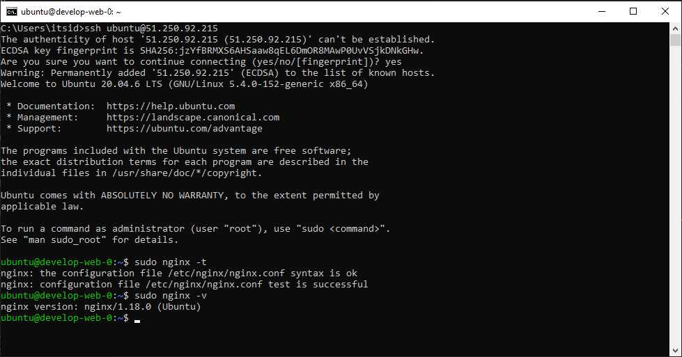
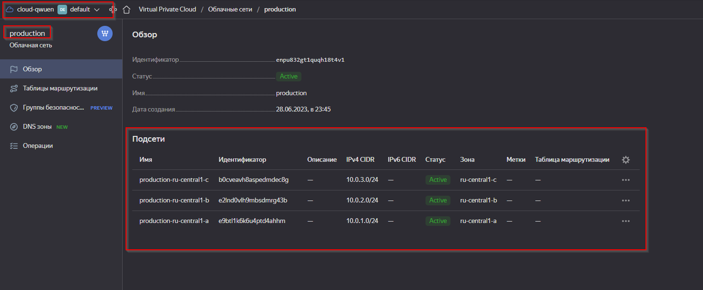

# Домашнее задание к занятию "Продвинутые методы работы с Terraform"

### Задание 1

1. Возьмите из [демонстрации к лекции готовый код](https://github.com/netology-code/ter-homeworks/tree/main/04/demonstration1) для создания ВМ с помощью remote модуля.
2. Создайте 1 ВМ, используя данный модуль. В файле cloud-init.yml необходимо использовать переменную для ssh ключа вместо хардкода. Передайте ssh-ключ в функцию template_file в блоке vars ={} .
Воспользуйтесь [**примером**](https://grantorchard.com/dynamic-cloudinit-content-with-terraform-file-templates/). Обратите внимание что ssh-authorized-keys принимает в себя список, а не строку!
3. Добавьте в файл cloud-init.yml установку nginx.
4. Предоставьте скриншот подключения к консоли и вывод команды ```sudo nginx -t```.

  

------
### Задание 2

1. Напишите локальный модуль vpc, который будет создавать 2 ресурса: **одну** сеть и **одну** подсеть в зоне, объявленной при вызове модуля. например: ```ru-central1-a```.
2. Модуль должен возвращать значения vpc.id и subnet.id
3. Замените ресурсы yandex_vpc_network и yandex_vpc_subnet, созданным модулем.
4. Сгенерируйте документацию к модулю с помощью terraform-docs.    
 
Ссылка на модуль [vpc](/assets/terraform-04-advanced-working-methods/src_1/vpc//main.tf)  
Ссылка на [main.tf](/assets/terraform-04-advanced-working-methods/src_1/main.tf)   
Ссылка на [README](/assets//terraform-04-advanced-working-methods/src_1/vpc/README.md)  

---
### Задание 3
1. Выведите список ресурсов в стейте.  
```sh
PS D:\projects\devops-netology\assets\terraform-04-advanced-working-methods\src_1> terraform state list
data.template_file.cloudinit
module.test-vm.data.yandex_compute_image.my_image
module.test-vm.yandex_compute_instance.vm[0]
module.vpc_dev.yandex_vpc_network.develop
module.vpc_dev.yandex_vpc_subnet.develop
```
2. Удалите из стейта модуль vpc.
```sh
PS D:\projects\devops-netology\assets\terraform-04-advanced-working-methods\src_1> terraform state rm "module.vpc_dev.yandex_vpc_network.develop"
Removed module.vpc_dev.yandex_vpc_network.develop
Successfully removed 1 resource instance(s).
PS D:\projects\devops-netology\assets\terraform-04-advanced-working-methods\src_1> terraform state rm "module.vpc_dev.yandex_vpc_subnet.develop" 
Removed module.vpc_dev.yandex_vpc_subnet.develop
Successfully removed 1 resource instance(s).
```
3. Импортируйте его обратно. Проверьте terraform plan - изменений быть не должно.
Приложите список выполненных команд и вывод.
```sh
PS D:\projects\devops-netology\assets\terraform-04-advanced-working-methods\src_1> terraform import "module.vpc_dev.yandex_vpc_network.develop" enpno4bepjcvji48uj1j      
data.template_file.cloudinit: Reading...
data.template_file.cloudinit: Read complete after 0s [id=816b655432a677c121d6deb4a0156b06c36014aeef6e39cedc68f2acb7d6b98c]
module.vpc_dev.yandex_vpc_network.develop: Importing from ID "enpno4bepjcvji48uj1j"...
module.test-vm.data.yandex_compute_image.my_image: Reading...
module.vpc_dev.yandex_vpc_network.develop: Import prepared!
  Prepared yandex_vpc_network for import
module.vpc_dev.yandex_vpc_network.develop: Refreshing state... [id=enpno4bepjcvji48uj1j]
module.test-vm.data.yandex_compute_image.my_image: Read complete after 0s [id=fd852pbtueis1q0pbt4o]

Import successful!

The resources that were imported are shown above. These resources are now in
your Terraform state and will henceforth be managed by Terraform.

PS D:\projects\devops-netology\assets\terraform-04-advanced-working-methods\src_1> terraform import "module.vpc_dev.yandex_vpc_subnet.develop" e9beha0h8tdn06m8lju4       
data.template_file.cloudinit: Reading...
data.template_file.cloudinit: Read complete after 0s [id=816b655432a677c121d6deb4a0156b06c36014aeef6e39cedc68f2acb7d6b98c]
module.test-vm.data.yandex_compute_image.my_image: Reading...
module.vpc_dev.yandex_vpc_subnet.develop: Importing from ID "e9beha0h8tdn06m8lju4"...
module.vpc_dev.yandex_vpc_subnet.develop: Import prepared!
  Prepared yandex_vpc_subnet for import
module.vpc_dev.yandex_vpc_subnet.develop: Refreshing state... [id=e9beha0h8tdn06m8lju4]
module.test-vm.data.yandex_compute_image.my_image: Read complete after 1s [id=fd852pbtueis1q0pbt4o]

Import successful!

The resources that were imported are shown above. These resources are now in
your Terraform state and will henceforth be managed by Terraform.
PS 
D:\projects\devops-netology\assets\terraform-04-advanced-working-methods\src_1> terraform plan
data.template_file.cloudinit: Reading...
data.template_file.cloudinit: Read complete after 0s [id=816b655432a677c121d6deb4a0156b06c36014aeef6e39cedc68f2acb7d6b98c]
module.test-vm.data.yandex_compute_image.my_image: Reading...
module.vpc_dev.yandex_vpc_network.develop: Refreshing state... [id=enpno4bepjcvji48uj1j]
module.test-vm.data.yandex_compute_image.my_image: Read complete after 0s [id=fd852pbtueis1q0pbt4o]
module.vpc_dev.yandex_vpc_subnet.develop: Refreshing state... [id=e9beha0h8tdn06m8lju4]
module.test-vm.yandex_compute_instance.vm[0]: Refreshing state... [id=fhmvde3847dq3rd6rj4k]

No changes. Your infrastructure matches the configuration.

Terraform has compared your real infrastructure against your configuration and found no differences, so no changes are needed.
```
## Дополнительные задания (со звездочкой*)

**Настоятельно рекомендуем выполнять все задания под звёздочкой.**   Их выполнение поможет глубже разобраться в материале.   
Задания под звёздочкой дополнительные (необязательные к выполнению) и никак не повлияют на получение вами зачета по этому домашнему заданию. 

---
### Задание 4*

1. Измените модуль vpc так, чтобы он мог создать подсети во всех зонах доступности, переданных в переменной типа list(object) при вызове модуля.  
  
Ссылка на модуль [vpc_2](/assets/terraform-04-advanced-working-methods/src_1/vpc_2/main.tf)  

  


<details>
<summary>Листинг команд</summary>

```sh
PS D:\projects\devops-netology\assets\terraform-04-advanced-working-methods\src_1> terraform apply -target module.vpc_prod

Terraform used the selected providers to generate the following execution plan. Resource actions are indicated with the following symbols:
  + create

Terraform will perform the following actions:

  # module.vpc_prod.yandex_vpc_network.develop will be created
  + resource "yandex_vpc_network" "develop" {
      + created_at                = (known after apply)
      + default_security_group_id = (known after apply)
      + folder_id                 = (known after apply)
      + id                        = (known after apply)
      + labels                    = (known after apply)
      + name                      = "production"
      + subnet_ids                = (known after apply)
    }

  # module.vpc_prod.yandex_vpc_subnet.develop[0] will be created
  + resource "yandex_vpc_subnet" "develop" {
      + created_at     = (known after apply)
      + folder_id      = (known after apply)
      + id             = (known after apply)
      + labels         = (known after apply)
      + name           = "production-ru-central1-a"
      + network_id     = (known after apply)
      + v4_cidr_blocks = [
          + "10.0.1.0/24",
        ]
      + v6_cidr_blocks = (known after apply)
      + zone           = "ru-central1-a"
    }

  # module.vpc_prod.yandex_vpc_subnet.develop[1] will be created
  + resource "yandex_vpc_subnet" "develop" {
      + created_at     = (known after apply)
      + folder_id      = (known after apply)
      + id             = (known after apply)
      + labels         = (known after apply)
      + name           = "production-ru-central1-b"
      + network_id     = (known after apply)
      + v4_cidr_blocks = [
          + "10.0.2.0/24",
        ]
      + v6_cidr_blocks = (known after apply)
      + zone           = "ru-central1-b"
    }

  # module.vpc_prod.yandex_vpc_subnet.develop[2] will be created
  + resource "yandex_vpc_subnet" "develop" {
      + created_at     = (known after apply)
      + folder_id      = (known after apply)
      + id             = (known after apply)
      + labels         = (known after apply)
      + name           = "production-ru-central1-c"
      + network_id     = (known after apply)
      + v4_cidr_blocks = [
          + "10.0.3.0/24",
        ]
      + v6_cidr_blocks = (known after apply)
      + zone           = "ru-central1-c"
    }

Plan: 4 to add, 0 to change, 0 to destroy.
╷
│ Warning: Resource targeting is in effect
│
│ You are creating a plan with the -target option, which means that the result of this plan may not represent all of the changes requested by the current configuration.
│
│ The -target option is not for routine use, and is provided only for exceptional situations such as recovering from errors or mistakes, or when Terraform specifically suggests to use it as part of an error  
│ message.
╵

Do you want to perform these actions?
  Terraform will perform the actions described above.
  Only 'yes' will be accepted to approve.

  Enter a value: yes

module.vpc_prod.yandex_vpc_network.develop: Creating...
module.vpc_prod.yandex_vpc_network.develop: Creation complete after 1s [id=enpu832gt1quqh18t4v1]
module.vpc_prod.yandex_vpc_subnet.develop[0]: Creating...
module.vpc_prod.yandex_vpc_subnet.develop[1]: Creating...
module.vpc_prod.yandex_vpc_subnet.develop[2]: Creating...
module.vpc_prod.yandex_vpc_subnet.develop[1]: Creation complete after 1s [id=e2lnd0vlh9mbsdmrg43b]
module.vpc_prod.yandex_vpc_subnet.develop[2]: Creation complete after 1s [id=b0cveavh8aspedmdec8g]
module.vpc_prod.yandex_vpc_subnet.develop[0]: Creation complete after 2s [id=e9btl1k6k6u4ptd4ahhm]
╷
│ Warning: Applied changes may be incomplete
│
│ The plan was created with the -target option in effect, so some changes requested in the configuration may have been ignored and the output values may not be fully updated. Run the following command to     
│ verify that no other changes are pending:
│     terraform plan
│
│ Note that the -target option is not suitable for routine use, and is provided only for exceptional situations such as recovering from errors or mistakes, or when Terraform specifically suggests to use it   
│ as part of an error message.
╵

Apply complete! Resources: 4 added, 0 changed, 0 destroyed.
```
</details>

----


