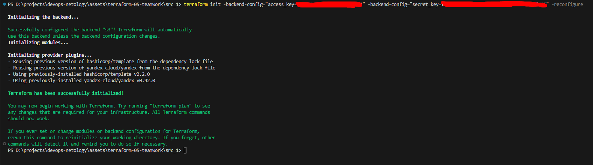
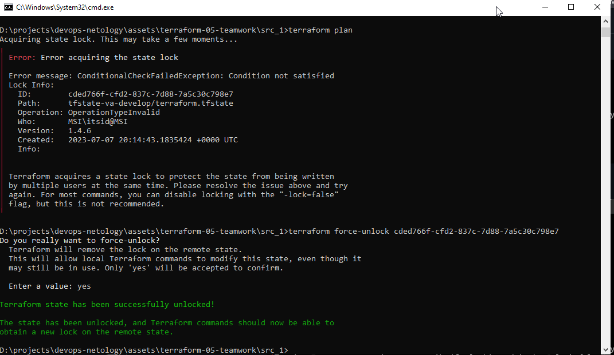
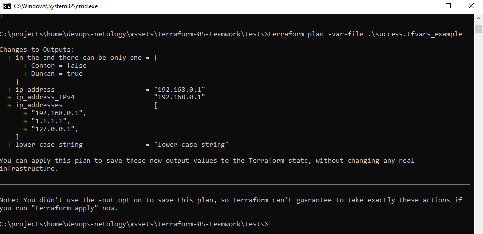
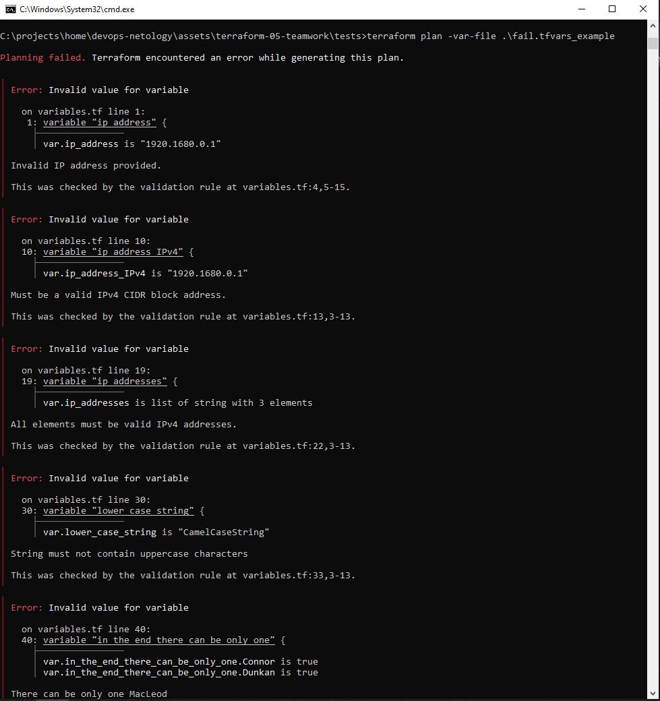

# Домашнее задание к занятию "Использование Terraform в команде"

### Задание 1

1. Возьмите код:
- из [ДЗ к лекции №04](https://github.com/netology-code/ter-homeworks/tree/main/04/src) 
- из [демо к лекции №04](https://github.com/netology-code/ter-homeworks/tree/main/04/demonstration1).
2. Проверьте код с помощью tflint и checkov. Вам не нужно инициализировать этот проект.
3. Перечислите какие **типы** ошибок обнаружены в проекте (без дублей).

### Результаты анализа tflint:  
- `Warning: Missing version constraint for provider "yandex" in `required_providers` (terraform_required_providers)`
- `Warning: [Fixable] variable is declared but not used (terraform_unused_declarations)`  
- `Warning: Module source uses a default branch as ref (main) (terraform_module_pinned_source)`  

### Результаты анализа checkov:  
- `Check: CKV_TF_1: "Ensure Terraform module sources use a commit hash"`

<details>
<summary>Проект `demonstration1`</summary>

```sh
qwuen@MSI:/mnt/d/projects/devops-netology/assets/terraform-05-teamwork$ tflint --chdir demonstration1/
6 issue(s) found:

Warning: Missing version constraint for provider "yandex" in `required_providers` (terraform_required_providers)

  on demonstration1/main.tf line 3:
   3:     yandex = {
   4:       source = "yandex-cloud/yandex"
   5:     }

Reference: https://github.com/terraform-linters/tflint-ruleset-terraform/blob/v0.4.0/docs/rules/terraform_required_providers.md

Warning: Module source "git::https://github.com/udjin10/yandex_compute_instance.git?ref=main" uses a default branch as ref (main) (terraform_module_pinned_source)

  on demonstration1/main.tf line 33:
  33:   source          = "git::https://github.com/udjin10/yandex_compute_instance.git?ref=main"

Reference: https://github.com/terraform-linters/tflint-ruleset-terraform/blob/v0.4.0/docs/rules/terraform_module_pinned_source.md

Warning: Missing version constraint for provider "template" in `required_providers` (terraform_required_providers)

  on demonstration1/main.tf line 51:
  51: data "template_file" "cloudinit" {

Reference: https://github.com/terraform-linters/tflint-ruleset-terraform/blob/v0.4.0/docs/rules/terraform_required_providers.md

Warning: [Fixable] variable "default_cidr" is declared but not used (terraform_unused_declarations)

  on demonstration1/variables.tf line 22:
  22: variable "default_cidr" {

Reference: https://github.com/terraform-linters/tflint-ruleset-terraform/blob/v0.4.0/docs/rules/terraform_unused_declarations.md

Warning: [Fixable] variable "vpc_name" is declared but not used (terraform_unused_declarations)

  on demonstration1/variables.tf line 28:
  28: variable "vpc_name" {

Reference: https://github.com/terraform-linters/tflint-ruleset-terraform/blob/v0.4.0/docs/rules/terraform_unused_declarations.md

Warning: [Fixable] variable "public_key" is declared but not used (terraform_unused_declarations)

  on demonstration1/variables.tf line 34:
  34: variable "public_key" {

Reference: https://github.com/terraform-linters/tflint-ruleset-terraform/blob/v0.4.0/docs/rules/terraform_unused_declarations.md
```

</details>

<details>
<summary>Проект `src`</summary>

```sh
qwuen@MSI:/mnt/d/projects/devops-netology/assets/terraform-05-teamwork$ tflint --chdir src
4 issue(s) found:

Warning: Missing version constraint for provider "yandex" in `required_providers` (terraform_required_providers)

  on src/providers.tf line 3:
   3:     yandex = {
   4:       source = "yandex-cloud/yandex"
   5:     }

Reference: https://github.com/terraform-linters/tflint-ruleset-terraform/blob/v0.4.0/docs/rules/terraform_required_providers.md

Warning: [Fixable] variable "vms_ssh_root_key" is declared but not used (terraform_unused_declarations)

  on src/variables.tf line 36:
  36: variable "vms_ssh_root_key" {

Reference: https://github.com/terraform-linters/tflint-ruleset-terraform/blob/v0.4.0/docs/rules/terraform_unused_declarations.md

Warning: [Fixable] variable "vm_web_name" is declared but not used (terraform_unused_declarations)

  on src/variables.tf line 43:
  43: variable "vm_web_name" {

Reference: https://github.com/terraform-linters/tflint-ruleset-terraform/blob/v0.4.0/docs/rules/terraform_unused_declarations.md

Warning: [Fixable] variable "vm_db_name" is declared but not used (terraform_unused_declarations)

  on src/variables.tf line 50:
  50: variable "vm_db_name" {

Reference: https://github.com/terraform-linters/tflint-ruleset-terraform/blob/v0.4.0/docs/rules/terraform_unused_declarations.md
```

</details>

### Анализ Checkov

<details>
<summary>Проект `demonstration1`</summary>

```sh
qwuen@MSI:/mnt/d/projects/devops-netology/assets/terraform-05-teamwork$ checkov -d demonstration1/
[ kubernetes framework ]: 100%|████████████████████|[1/1], Current File Scanned=cloud-init.yml
2023-07-07 16:53:24,690 [MainThread  ] [WARNI]  Failed to download module git::https://github.com/udjin10/yandex_compute_instance.git?ref=main:None (for external modules, the --download-external-modules flag is required)
[ secrets framework ]: 100%|████████████████████|[3/3], Current File Scanned=demonstration1/variables.tf
[ ansible framework ]: 100%|████████████████████|[1/1], Current File Scanned=cloud-init.yml
[ terraform framework ]: 100%|████████████████████|[2/2], Current File Scanned=variables.tf

       _               _
   ___| |__   ___  ___| | _______   __
  / __| '_ \ / _ \/ __| |/ / _ \ \ / /
 | (__| | | |  __/ (__|   < (_) \ V /
  \___|_| |_|\___|\___|_|\_\___/ \_/

By bridgecrew.io | version: 2.3.314

terraform scan results:

Passed checks: 0, Failed checks: 1, Skipped checks: 0

Check: CKV_TF_1: "Ensure Terraform module sources use a commit hash"
        FAILED for resource: test-vm
        File: /main.tf:32-48

                32 | module "test-vm" {
                33 |   source          = "git::https://github.com/udjin10/yandex_compute_instance.git?ref=main"
                34 |   env_name        = "develop"
                35 |   network_id      = yandex_vpc_network.develop.id
                36 |   subnet_zones    = ["ru-central1-a"]
                37 |   subnet_ids      = [ yandex_vpc_subnet.develop.id ]
                38 |   instance_name   = "web"
                39 |   instance_count  = 2
                40 |   image_family    = "ubuntu-2004-lts"
                41 |   public_ip       = true
                42 |
                43 |   metadata = {
                44 |       user-data          = data.template_file.cloudinit.rendered #Для демонстрации №3
                45 |       serial-port-enable = 1
                46 |   }
                47 |
                48 | }

```
</details>

<details>
<summary>Проект `src`</summary>

```sh
qwuen@MSI:/mnt/d/projects/devops-netology/assets/terraform-05-teamwork$ checkov -d src/
[ secrets framework ]: 100%|████████████████████|[4/4], Current File Scanned=src/variables.tf
[ terraform framework ]: 100%|████████████████████|[3/3], Current File Scanned=variables.tf

       _               _
   ___| |__   ___  ___| | _______   __
  / __| '_ \ / _ \/ __| |/ / _ \ \ / /
 | (__| | | |  __/ (__|   < (_) \ V /
  \___|_| |_|\___|\___|_|\_\___/ \_/

By bridgecrew.io | version: 2.3.314


```
</details>

------

### Задание 2

1. Возьмите ваш GitHub репозиторий с **выполненным ДЗ №4** в ветке 'terraform-04' и сделайте из него ветку 'terraform-05'
2. Повторите демонстрацию лекции: настройте YDB, S3 bucket, yandex service account, права доступа и мигрируйте State проекта в S3 с блокировками. Предоставьте скриншоты процесса в качестве ответа.
 
3. Закомитьте в ветку 'terraform-05' все изменения.
4. Откройте в проекте terraform console, а в другом окне из этой же директории попробуйте запустить terraform apply.
5. Пришлите ответ об ошибке доступа к State.
6. Принудительно разблокируйте State. Пришлите команду и вывод.



------
### Задание 3  

1. Сделайте в GitHub из ветки 'terraform-05' новую ветку 'terraform-hotfix'.
2. Проверье код с помощью tflint и checkov, исправьте все предупреждения и ошибки в 'terraform-hotfix', сделайте комит.
3. Откройте новый pull request 'terraform-hotfix' --> 'terraform-05'. 
4. Вставьте в комментарий PR результат анализа tflint и checkov, план изменений инфраструктуры из вывода команды terraform plan.
5. Пришлите ссылку на PR для ревью(вливать код в 'terraform-05' не нужно).

<details>
<summary>Анализ `src_1`</summary>

```sh
qwuen@MSI:/mnt/d/projects/devops-netology/assets/terraform-05-teamwork$ checkov -d src_1/
[ kubernetes framework ]: 100%|████████████████████|[1/1], Current File Scanned=cloud-init.yml
[ secrets framework ]: 100%|████████████████████|[6/6], Current File Scanned=src_1/vpc_2/variables.tf
[ ansible framework ]: 100%|████████████████████|[1/1], Current File Scanned=cloud-init.yml
2023-07-08 10:18:04,635 [MainThread  ] [WARNI]  Failed to download module git::https://github.com/udjin10/yandex_compute_instance.git?ref=main:None (for external modules, the --download-external-modules flag is required)
[ terraform framework ]: 100%|████████████████████|[5/5], Current File Scanned=vpc_2/variables.tf

       _               _
   ___| |__   ___  ___| | _______   __
  / __| '_ \ / _ \/ __| |/ / _ \ \ / /
 | (__| | | |  __/ (__|   < (_) \ V /
  \___|_| |_|\___|\___|_|\_\___/ \_/

By bridgecrew.io | version: 2.3.314

terraform scan results:

Passed checks: 0, Failed checks: 1, Skipped checks: 0

Check: CKV_TF_1: "Ensure Terraform module sources use a commit hash"
        FAILED for resource: test-vm
        File: /main.tf:43-59

                43 | module "test-vm" {
                44 |   source         = "git::https://github.com/udjin10/yandex_compute_instance.git?ref=main"
                45 |   env_name       = "develop"
                46 |   network_id     = module.vpc_dev.vpc_id
                47 |   subnet_zones   = module.vpc_dev.vpc_zones
                48 |   subnet_ids     = module.vpc_dev.subnet_ids
                49 |   instance_name  = "web"
                50 |   instance_count = 1
                51 |   image_family   = "ubuntu-2004-lts"
                52 |   public_ip      = true
                53 |
                54 |   metadata = {
                55 |     user-data          = data.template_file.cloudinit.rendered
                56 |     serial-port-enable = 1
                57 |   }
                58 |
                59 | }


qwuen@MSI:/mnt/d/projects/devops-netology/assets/terraform-05-teamwork$ tflint --chdir src_1
6 issue(s) found:

src_1/main.tf:44:20: Warning - Module source "git::https://github.com/udjin10/yandex_compute_instance.git?ref=main" uses a default branch as ref (main) (terraform_module_pinned_source)
src_1/main.tf:3:14: Warning - Missing version constraint for provider "yandex" in `required_providers` (terraform_required_providers)
src_1/main.tf:62:1: Warning - Missing version constraint for provider "template" in `required_providers` (terraform_required_providers)
src_1/variables.tf:28:1: Warning - variable "vpc_name" is declared but not used (terraform_unused_declarations)
src_1/variables.tf:34:1: Warning - variable "public_key" is declared but not used (terraform_unused_declarations)
src_1/variables.tf:22:1: Warning - variable "default_cidr" is declared but not used (terraform_unused_declarations)
```
</details>

------
### Задание 4

1. Напишите переменные с валидацией и протестируйте их, заполнив default верными и неверными значениями. Предоставьте скриншоты проверок:

- type=string, description="ip-адрес", проверка что значение переменной содержит верный IP-адрес с помощью функций cidrhost() или regex(). Тесты:  "192.168.0.1" и "1920.1680.0.1"
- type=list(string), description="список ip-адресов", проверка что все адреса верны.  Тесты:  ["192.168.0.1", "1.1.1.1", "127.0.0.1"] и ["192.168.0.1", "1.1.1.1", "1270.0.0.1"]

Решение заданий 4,5:  
[Исходный код тестов](assets/terraform-05-teamwork/tests/)

### Успешный тест
  

### Неуспешный тест
  

------
### Задание 5*
1. Напишите переменные с валидацией:
- type=string, description="любая строка", проверка что строка не содержит в себе символов верхнего регистра
- type=object, проверка что введено только одно из опциональных значений по примеру:
```
variable "in_the_end_there_can_be_only_one" {
    description="Who is better Connor or Duncan?"
    type = object({
        Dunkan = optional(bool)
        Connor = optional(bool)
    })

    default = {
        Dunkan = true
        Connor = false
    }

    validation {
        error_message = "There can be only one MacLeod"
        condition = <проверка>
    }
}
```
------
